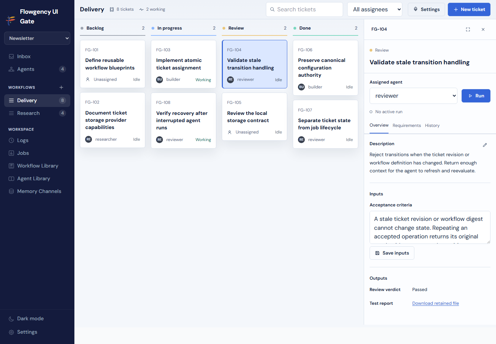

# Flowgency

**Ticket-driven orchestration for teams of AI agents.**

See agents take work, move tickets through predefined workflows, and keep every
transition inspectable from one local-first control plane.



## How tickets flow

Agents surface observations as they work. Observations converge into proposals —
questions waiting for human decisions. Approved decisions become durable execution
jobs. The board shows each ticket's status as agents take and complete work. Every
transition is recorded and revisitable from the dashboard.

## Supporting capabilities

- **Reusable blueprints** — Agent Library holds standard `AGENTS.md` and Agent
  Skills, separated from configured identity.
- **Explicit instances** — Each instance belongs to one team and pins one
  blueprint, one integration, and one permission policy.
- **Scheduled routines** — Each routine selects one saved prompt, one schedule,
  and optional semantic memory.
- **Semantic memory** — Selectors for run, routine, agent, team, or declared
  channel scope keep context focused without manual file management.
- **Local-first** — No cloud account required. The dashboard and all data live on
  your machine.

## Quick start

Flowgency requires Python 3.11 or newer.

```text
git clone https://github.com/Blackhex/flowgency.git
cd flowgency
python -m pip install -e .
flowgency serve
```

The dashboard opens at `http://127.0.0.1:8500`. Set `FLOWGENCY_CONFIG` to select
the one authoritative config file.

Start Flowgency, choose the Flowgency data root and supported AI integration, complete the flowgency-setup conversation, and return to the dashboard automatically.
Users may enter home syntax such as `~/Flowgency`; setup expands it to the
user's home directory before deriving canonical paths. The guided conversation asks
for the project workspace as its first question, then names your team and
proposes agent blueprints and instances. Setup proposes useful routines and
recommended schedules; approve them, request changes, or explicitly choose
manual-only operation. It writes one validated `config.yaml` with no individual
storage-path questions.

## Configuration

Flowgency uses one authoritative YAML document. The top-level `schema_version: 1`
and `flowgency` root are required:

```yaml
schema_version: 1
flowgency:
  title: My Project
  default_team: my-project
  agent_library: C:/Flowgency/agent-library
  compilation_cache: C:/Flowgency/compiled-agents
  memory_store: C:/Flowgency/memory
  prompt_store: C:/Flowgency/prompts
teams:
  my-project:
    name: My Project
    workspace_path: C:/Projects/my-project
    path: C:/Flowgency/teams/my-project
    default_integration: copilot
```

See [config.yaml.example](config.yaml.example) and [Configuration](kb/configuration.md)
for the complete reference. The [Flowgency Setup Skill](kb/setup-skill.md) generates
a validated config from a guided conversation.

## Scheduling

Install the singleton dispatcher to run routines on a platform timer:

```text
flowgency dispatch install --config C:/Flowgency/config.yaml
flowgency dispatch status --config C:/Flowgency/config.yaml
```

## Integrations

Flowgency supports multiple AI runtimes via pluggable integrations. Each instance
pins one integration explicitly. See [Integrations](kb/integrations.md) for
supported runtimes and [Contributing Integrations](kb/contributing-integrations.md)
to add one.

## Local-first operation

Flowgency assumes trusted local access. There is no built-in authentication. The
dashboard, config, blueprints, memory, and all records live on your local
filesystem. Use a reverse proxy (Traefik, nginx, Caddy) if you need access controls.

## Documentation

- [Getting Started](kb/getting-started.md)
- [Configuration](kb/configuration.md)
- [Directory Structure](kb/directory-structure.md)
- [Agent Identity](kb/agent-identity.md)
- [Integrations](kb/integrations.md)
- [Dispatch and Routines](kb/dispatch.md)
- [Data Formats](kb/data-formats.md)
- [Deployment](kb/deployment.md)
- [Flowgency Setup Skill](kb/setup-skill.md)
- [Contributing Integrations](kb/contributing-integrations.md)

## Development

```text
python -m pytest tests/ -q
```

Install test dependencies (pytest, httpx, Pillow) with:

```text
python -m pip install -e '.[test]'
```

Flowgency uses Python, FastAPI, Jinja2, and filesystem-backed YAML and Markdown.

## Contributing

See [AGENTS.md](AGENTS.md) for the repository guide, development workflow, and
commit conventions. Contributions follow the development workflow described there:
feature branches in `.worktrees/`, conventional commits, and a full test suite
before integration.

## License

[AGPL-3.0](LICENSE)
