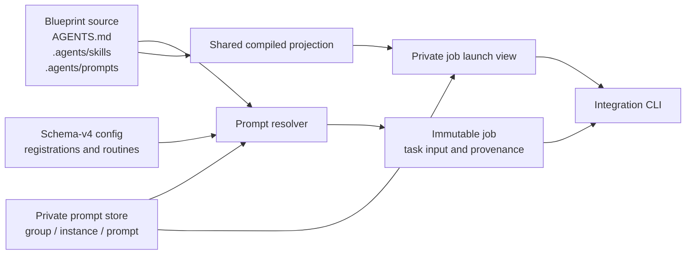

# Portable Agent Prompts And Roster Launch - Design

**Date:** 2026-07-26
**Status:** Approved design, pending written-spec review
**Topic:** Portable reusable prompt source, scheduled and manual prompt launches, and prompt authoring scopes

## Problem

The Agents roster currently gives its most prominent space to instance creation,
even though users create instances infrequently and spend most visits observing
state or launching work. The current web UI has no launch controls. A surviving
`POST /{group}/agents/{agent}/run` endpoint can run only a configured routine.

Older releases stored task prompts under group directories and exposed them on
agent cards. Schema v3 removed that filesystem-coupled control plane and replaced
scheduled prompt assignments with routines that select Agent Skills. That joined
two concepts that need to remain independent:

- A prompt defines **what task to run**.
- `AGENTS.md` and Agent Skills improve **how an agent behaves** across prompt
  invocations.

Reusable task prompts need canonical Markdown source again without restoring
prompt-file schedules, directory discovery, or runtime-native files as
configuration authority. Prompts also need two ownership scopes:

- Blueprint prompts shared by every instance pinned to that blueprint.
- Private prompts available to one configured instance only.

## Goals

- Store shared prompt source under the owning blueprint at
  `.agents/prompts/<slug>.prompt.md`.
- Store instance-private prompt source as Markdown in a dedicated Agency prompt
  store while registering the prompt slug in config.
- Make schedules select prompts, never skills.
- Support manual launches from either a saved shared/private prompt or one-off
  task text.
- Pass immutable prompt text to every integration through the existing task-file
  or CLI-argument contract.
- Render canonical prompts into integration-native project locations where a
  safe native format exists.
- Hide instance creation behind an **Add agent** button and make agent state and
  launch controls the primary roster experience.
- Preserve config revision checks, immutable jobs, cache isolation, sandbox
  policy, memory selection, job history, and concurrent job support.

## Non-Goals

- Converting schema-v3 config, former group prompt directories, or the current
  Agent Library automatically.
- Treating a prompt as an Agent Skill or selecting a skill from a routine.
- Adding runtime-specific variable interpolation to canonical prompts.
- Writing prompt files into user-home locations.
- Persisting one-off launch text into a reusable prompt catalog.
- Changing generated decision prompts, decision execution, or decision retries.
- Adding live job-output streaming.

## Authority Model

Schema v4 preserves one explicit control plane and separates source from
generated runtime assets:

| Authority | Owns |
| --- | --- |
| `config.yaml` | Groups, instances, pinned blueprints/integrations, private prompt registration, scoped routine selectors, schedules, arguments, runtime policy, and memory selectors |
| `agency.agent_library` | Reusable blueprint `AGENTS.md`, Agent Skills, and shared prompt Markdown |
| `agency.prompt_store` | Markdown source registered as private to one group instance |
| `agency.compilation_cache` | Disposable immutable shared runtime projections |
| Per-job private launch view | A copy of the shared projection plus rendered private prompt assets |
| Durable job spec | Immutable task input, prompt provenance, runtime policy, memory binding, and blueprint digest |

Neither the scheduler nor the worker scans a directory to decide what prompts or
schedules exist. Config selects the instance, prompt scope/name, schedule, and
memory. Source files provide only validated task content and presentation
metadata.



## Storage Layout

### Shared Blueprint Prompts

Shared prompt source lives with reusable blueprint source:

```text
<agent_library>/<blueprint>/
|-- AGENTS.md
`-- .agents/
    |-- skills/
    |   `-- <skill>/SKILL.md
    `-- prompts/
        `-- <slug>.prompt.md
```

Every source byte remains part of the blueprint tree snapshot and source digest.
Changing a shared prompt therefore produces a new immutable compilation-cache
key and new job provenance.

### Instance-Private Prompts

Schema v4 adds one required global path:

```yaml
agency:
  prompt_store: C:/Agency/prompts
```

The source path is deterministic and cannot be overridden in config:

```text
<prompt_store>/<group>/<instance>/<slug>.prompt.md
```

The prompt store must resolve to a real writable directory and remain disjoint
from the Agent Library, compilation cache, memory store, every group root, and
every project workspace. Prompt operations reject symlinks, Windows reparse
points, non-regular files, and any resolved path outside the prompt-store root.

Config registers private slugs but contains neither source paths nor prompt
bodies. Files that exist without a matching config registration are ignored.
Missing files for registered prompts are validation errors.

## Canonical Prompt Format

Both scopes use the same UTF-8 Markdown format:

```markdown
---
name: pr-review
description: Review open pull requests for high-confidence defects.
argument-hint: Optional PR number or review focus
---

Review open pull requests or unmerged diffs for correctness, security, and
regression risks. Record high-confidence findings through the configured
pipeline.
```

Validation rules are strict:

- The filename is exactly `<slug>.prompt.md`.
- The slug is 1-64 lowercase letters, digits, or single hyphen separators.
- `name` is required and exactly matches the filename slug.
- `description` is required, nonblank, and at most 1024 characters.
- `argument-hint` is optional and must be a string when present.
- Product-specific fields such as `agent`, `model`, and `tools` are rejected.
  Config and effective runtime policy own those choices.
- Frontmatter must be a YAML mapping terminated before the Markdown body.
- The body after frontmatter must be nonblank UTF-8 Markdown.

The first version has no canonical placeholder language. Agency sends the
Markdown body without frontmatter. If invocation input is present, Agency
appends one deterministic `## Invocation input` section. Routine arguments use
a stable YAML list representation; manual additional instructions are appended
verbatim. Native clients may apply their normal behavior when a person invokes
the projected prompt interactively, but that behavior is not job authority.

## Schema Version 4

Replacing required `routine.skill` with a required scoped prompt selector is a
breaking control-plane change and therefore increments the config schema. The
application accepts only schema v4 after this feature. It does not add schema-v3
aliases, dual reads, fallback loaders, startup conversion, or implicit defaults.

```yaml
schema_version: 4
agency:
  title: Agency
  default_group: example
  ai_backend: copilot
  agent_library: C:/Agency/agent-library
  compilation_cache: C:/Agency/compiled-agents
  memory_store: C:/Agency/memory
  prompt_store: C:/Agency/prompts
groups:
  example:
    name: Example
    workspace_path: C:/Projects/example
    path: C:/Agency/groups/example
    default_integration: copilot
    dispatch:
      enabled: true
      daily_limit: 20
    agents:
      - name: reviewer
        blueprint: reviewer
        integration: copilot
        prompts:
          - local-triage
        routines:
          - id: morning-pr-review
            prompt:
              scope: blueprint
              name: pr-review
            arguments:
              - focus on correctness and security
            schedule:
              at: "08:00"
            memory:
              scope: routine
          - id: afternoon-triage
            prompt:
              scope: instance
              name: local-triage
            schedule:
              at: "14:00"
            memory:
              scope: agent
```

The model changes are:

- `AgencyConfig.prompt_store: Path` is required.
- `AgentInstance.prompts` is an ordered tuple of registered private prompt slugs.
- `Routine.prompt` is a required object with `scope` equal to `blueprint` or
  `instance` and a required prompt `name`.
- `Routine.skill` is removed.
- Existing routine ID, schedule, arguments, memory, and enabled semantics remain.
- Shared and private prompt slugs must be distinct in an instance's effective
  catalog because native prompt files cannot represent both without ambiguity.

Pure config validation checks shape and identifiers. Resolved validation checks
that the pinned blueprint exists, every registered private source file exists,
every routine target exists in the declared scope, prompt formats are valid, and
all authority paths remain disjoint.

## Prompt Catalogs And Resolution

Blueprint inspection exposes parsed prompt metadata alongside skills and the
tree snapshot. An instance's effective prompt catalog is the union of:

- Every validated prompt in its pinned blueprint.
- Every validated private slug explicitly registered on that instance.

No filename prefix, schedule name, skill name, or directory listing creates an
assignment. Scope and name are always explicit. Shorthand selectors and
private-over-shared shadowing are rejected.

Scheduled resolution performs these steps:

1. Load the current config snapshot and selected instance/routine.
2. Inspect the pinned blueprint and resolve the prompt from the declared scope.
3. For private scope, resolve the deterministic prompt-store path and verify the
   file remains registered, contained, regular, and valid.
4. Parse the canonical prompt and construct immutable task input from its body
   plus routine arguments.
5. Bind the blueprint digest, effective runtime policy, semantic memory, and
   prompt provenance before job submission.

Manual saved-prompt resolution performs the same steps without requiring a
routine. Manual one-off resolution validates nonblank task text and snapshots it
directly.

`prompt_source` records enough provenance to identify exactly what was used:

- Shared: type, scope, prompt name, blueprint key, blueprint digest, and
  `.agents/prompts/<slug>.prompt.md` source path.
- Private: type, scope, prompt name, group, instance, config revision, resolved
  source path, and SHA-256 source digest.
- One-off: type `ad_hoc` with no reusable source path.

The worker never rereads prompt source. It writes `JobSpec.task_input` to the
existing task file and passes that task through each integration's current
non-interactive CLI contract. Editing or deleting a source prompt after
submission cannot alter a queued or running job.

New prompt-backed jobs do not select or explicitly activate a skill. Skills are
projected independently according to each integration's existing skill
capabilities. Legacy nullable skill fields may remain readable in historical
durable job records, but new schema-v4 submissions leave them unset.

The existing `scheduled_prompt` and `manual_prompt` trigger names remain. Their
validation changes from requiring a routine-selected skill to requiring the
appropriate immutable prompt source: scheduled jobs require a resolved routine
and saved prompt, while manual jobs accept a saved prompt or ad hoc text.

Generated decision and decision-retry task input remains code-generated from the
proposal, answers, and decision note. It does not require a catalog prompt.

## Runtime Projection

Projector capabilities add an optional native prompt target/renderer and an
explicit prompt-discovery flag. Shared prompt output belongs to the immutable
blueprint compilation cache. Adding prompt output changes projector inventories,
so affected projector versions increment. Every target below is relative to the
compiled runtime or per-job private launch root; Agency does not write these
generated files into the project workspace.

| Integration | Native project output | Rendering |
| --- | --- | --- |
| GitHub Copilot | `.github/prompts/<slug>.prompt.md` | Copy canonical bytes unchanged |
| Claude Code | `.claude/commands/<slug>.md` | Copy canonical bytes unchanged; commands remain supported even though Claude recommends skills for reusable behavior |
| Gemini CLI | `.gemini/commands/<slug>.toml` | Deterministically encode description and Markdown body as structured TOML |
| No safe project prompt format | None | Continue direct task-file/CLI execution without writing user-home files |

Codex custom prompts are deprecated and user-scoped, so Agency never writes
`~/.codex/prompts`. The absence of a native project prompt target does not make
an integration unable to run prompt-backed Agency jobs.

Instruction and skill files retain their byte-preservation contract. A
transformed prompt renderer validates output against deterministic expected
bytes rather than requiring source-byte equality. The cache manifest lists all
generated runtime files.

For each job, the worker first copies the shared immutable cache artifact into
the existing private launch view. It then validates and renders every registered
private prompt for that instance into the same native prompt target. This overlay
is job-local, never mutates the cache, and never includes prompts registered to a
different instance. One-off task text is not projected as a reusable native
prompt.

## Prompt Authoring Surfaces

### Shared Prompts

Agent Library remains the owner of reusable blueprint source. Blueprint detail
shows `AGENTS.md`, Skills, and Prompts as separate concepts. A Prompts view lets
the user:

- Add a prompt by stable slug.
- Select and edit an existing canonical prompt.
- Delete a prompt only when no configured routine references it.
- See validation errors and the current blueprint source digest.

Writes reuse the existing per-blueprint lock, expected digest, staged full-tree
validation, and atomic directory replacement. The source-path allowlist expands
only to the exact `.agents/prompts/<slug>.prompt.md` shape; arbitrary blueprint
paths remain rejected.

### Private Prompts

Agent Detail gains a **Prompts** tab. It lists shared blueprint prompts read-only
with links to Agent Library and provides create/edit/delete controls for private
prompts. Private creation registers the slug in config and publishes validated
Markdown under the deterministic prompt-store path. Editing uses an expected
source digest. Deletion is blocked while an instance routine references the
prompt.

Private file operations use prompt-scoped locks and revision-checked config
patches. Publishing a file before registration is safe because unregistered
files are ignored; a failed registration cleans up the newly published file
under the same operation lock when its digest still matches. Deletion unregisters
the prompt before removing its file; a leftover unregistered file is harmless
and eligible for cleanup.

Agent Detail's **Routines** tab lists prompts from the effective catalog grouped
by scope and writes the full explicit selector. It no longer presents blueprint
skills as routine choices.

### Instance Lifecycle

Moving an instance relocates its private prompt namespace within the dedicated
store. The move acquires source and target locks in deterministic order, rejects
target collisions, stages the target files, applies the revision-checked config
move, and removes the old namespace only after success. A failure restores the
pre-move registered state.

Removing an instance requires the existing explicit confirmation and removes its
private prompt namespace after the config patch succeeds. File cleanup failure
is reported as an actionable orphan without restoring a removed instance.

## Agents Roster UX

The roster prioritizes observation and launching:

- The header shows the page title, instance count, and **Add agent**.
- **Add agent** opens the existing creation fields in a focused dialog; the form
  consumes no normal page space.
- A failed creation reopens the dialog with entered values and field errors.
- Successful creation remains POST plus 303 redirect.

Every agent card keeps identity, blueprint, integration, memory, active-job
state, Activity, and Configure at the top. Beneath that, the approved fully
expanded launcher contains:

- A `Saved prompt | One-off` segmented mode control.
- Saved mode: grouped shared/private prompt selector, selected description,
  optional invocation-input textarea, memory-for-this-run selector, and
  **Run prompt**.
- One-off mode: required task textarea, memory selector, and **Run one-off**.
- If the effective catalog is empty, Saved prompt is unavailable and One-off is
  selected automatically.

The existing run endpoint accepts either an explicit scoped saved-prompt
selector or one-off text, never both. Saved-prompt launches may include
additional invocation input and do not require a routine. The endpoint returns
`202` with the durable job ID.

On success, the card immediately adds a linked queued/running badge. Concurrent
launches remain allowed, controls stay enabled, and the card shows an active-job
count rather than a singular busy state. Validation or submission failures render
inside the card without discarding entered text.

Disabled routines do not disable their prompt in the manual catalog. Routines
own schedules; prompt catalogs own reusable launch choices.

## Setup Flow

The `agency-setup` skill and setup documentation move to schema v4 and derive a
fifth global path, `<agency-data-root>/prompts`. The consolidated path review
includes that store and validates it against every other authority root.

For each approved role, setup distinguishes:

- Task definitions that become canonical prompt files.
- Cross-task behavior or capabilities that become Agent Skills.
- Persistent role guidance that belongs in `AGENTS.md`.

Setup authors blueprint prompts as shared by default. It creates a private
prompt only when the user explicitly scopes that task to one instance. It then
registers private slugs, writes scoped prompt selectors on routines, validates
all prompt files and references, and performs the one revision-checked atomic
config write. It creates no compatibility layout and performs no conversion.

## Error Handling

The feature fails closed with field-specific corrective guidance for:

- Invalid slugs, mismatched names, malformed frontmatter, unsupported metadata,
  invalid UTF-8, or blank prompt bodies.
- Missing registered private files or unknown scoped routine targets.
- Shared/private slug collisions within one effective catalog.
- Missing, overlapping, unwritable, symlinked, or reparse-point prompt-store
  paths.
- Path traversal, non-regular files, and resolved paths outside an authority
  root.
- Stale config revisions, stale source digests, and concurrent source edits.
- Native renderer failures, missing projected files, generated-byte mismatches,
  or unexpected cache inventory.
- Blank one-off text, mutually supplied saved and one-off inputs, or invalid
  memory overrides.
- Instance move conflicts and partial filesystem failures.

Unregistered files never appear in the UI, routines, or jobs. Web forms preserve
entered content after recoverable errors. Job submission errors do not create a
successful UI state.

## Testing

### Source And Configuration

- Parse and validate shared and private prompt files, metadata, body, names, and
  UTF-8 encoding.
- Prove all shared prompt bytes affect the blueprint digest.
- Validate schema-v4 prompt-store requirements, private registrations, scoped
  selectors, unknown prompts, collisions, and path disjointness.
- Reject schema-v3 config without adding conversion or aliases.
- Reject traversal, symlinks, reparse points, non-regular files, and
  unregistered source discovery.

### Projection And Isolation

- Verify Copilot and Claude target paths and byte preservation.
- Verify deterministic Gemini TOML generation and escaping.
- Verify projector version/cache inventory changes and generated-output
  validation.
- Verify private overlays never mutate shared cache artifacts and never leak
  prompts between instances.
- Verify integrations without native prompt targets still run canonical task
  input.

### Jobs And Dispatch

- Resolve scheduled shared and private prompts with deterministic arguments.
- Resolve manual saved prompts with additional input and manual one-off text.
- Verify prompt provenance, content digests, memory selection, runtime policy,
  and immutable task input.
- Prove source edits after submission cannot alter queued/running jobs.
- Preserve concurrent jobs and active-job reporting.
- Preserve generated decision and retry behavior.

### Filesystem Transactions

- Serialize concurrent prompt edits and reject stale revisions/digests.
- Cover create cleanup, referenced-delete rejection, orphan handling, instance
  move rollback, target collision, removal, and Windows sharing/path behavior.

### Web And Setup

- Cover Agent Library shared prompt CRUD and usage checks.
- Cover Agent Detail private prompt CRUD and scoped routine editing.
- Cover the hidden Add-agent dialog and creation error state.
- Cover fully expanded saved/one-off launchers, grouped options, no-prompt state,
  inline errors, `202` job links, and concurrent active counts.
- Verify desktop and mobile rendering without control overlap or clipped text.
- Update `agency-setup` contract tests for schema v4, prompt authoring, private
  registration, skill orthogonality, and the fifth storage path.
- Run focused suites while iterating and the complete suite before review.

## Documentation Updates

Update the repository guide, README/config examples, configuration, directory
structure, integrations, dispatch, getting started, setup-skill, and agent
identity documentation to describe:

- Schema v4 and `agency.prompt_store`.
- Shared versus private prompt ownership.
- Prompt-backed routines and manual launches.
- Native projection as disposable output rather than authority.
- Skills and `AGENTS.md` as behavior independent from task prompts.

## Success Criteria

- A user can create a shared blueprint prompt and launch it from every instance
  using that blueprint.
- A user can create a Markdown prompt private to one instance and no other
  instance can list, project, or launch it.
- A schedule runs an explicit scoped prompt without selecting a skill.
- A user can launch a saved prompt or nonblank one-off task from a fully expanded
  agent card while other jobs are active.
- Instance creation is hidden behind **Add agent**.
- Every job executes immutable task text and records source provenance.
- Copilot, Claude, and Gemini receive valid native prompt assets where supported,
  while all executable integrations continue to receive direct task input.
- Config, source, cache, private launch views, and durable jobs retain clear,
  testable authority boundaries.