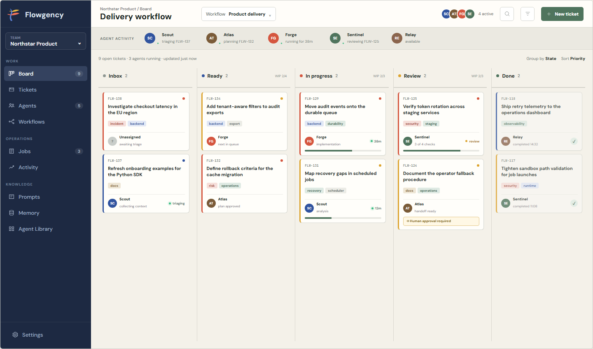

# Flowgency Rebrand Design

## Summary

This change establishes **Flowgency** as the sole product identity and prepares
the project for a ticket-driven future without implementing ticket workflows
yet. It is an atomic terminology break across source, configuration, package
metadata, executable names, runtime-owned paths, tests, documentation, and
visual assets.

The rebrand does not retain compatibility aliases. Existing behavior remains
the same behind the renamed interfaces: configuration still describes teams,
agent instances, integrations, permissions, routines, prompts, memory, durable
jobs, and human-governed execution.

## Goals

- Make `Flowgency` the only product name in the tracked tree.
- Rename public and internal branded identifiers consistently.
- Begin a new Flowgency configuration lineage at `schema_version: 1`.
- Position Flowgency as ticket-driven orchestration for teams of AI agents.
- Replace the existing visual identity with the approved Flowgency tree.
- Add a synthesized workflow-board screenshot to the README.
- Preserve runtime behavior apart from intentional identifier and path breaks.
- Detect regressions to previous naming mechanically.

## Non-goals

- Do not implement tickets, boards, workflow definitions, state transitions,
  WIP limits, assignment rules, or new human-review behavior.
- Do not redesign existing application pages or change theme color values.
- Do not add migration, startup conversion, import shims, executable aliases,
  deprecated environment variables, or compatibility routes.
- Do not change job, memory, prompt, integration, permission, dispatch, record,
  or workspace semantics.
- Do not rewrite Git history, change configured Git remotes, or rename the
  physical checkout directory.
- Do not hand-edit ignored runtime configuration, build output, or package
  metadata generated by build tools.

### Approved Completion Amendment (2026-09-06)

The user approved fixing the existing Dashboard light-theme contrast failures
to unblock the required integration gate. This is a narrow exception to the
theme-color restriction: adjust fleet text and work-queue foreground/background
classes only, preserving layout and all dark-theme colors. Keep the full
accessibility gate enabled and update only affected light-theme snapshots.

## Canonical Naming Contract

| Surface | Canonical value |
| --- | --- |
| Product and default application title | `Flowgency` |
| Canonical repository | `https://github.com/Blackhex/flowgency` |
| Python distribution | `flowgency` |
| Python import package | `flowgency` |
| CLI executable and argparse program | `flowgency` |
| Configuration root | `flowgency:` |
| Current configuration version | `schema_version: 1` |
| Environment variable prefix | `FLOWGENCY_` |
| Setup skill and invocation | `flowgency-setup` |
| Runtime-owned hidden directory | `.flowgency` |
| Scheduler/service identifiers | `Flowgency*` or `flowgency-*` by platform |
| Template, CSS, and PWA identifiers | `flowgency_*` or `flowgency-*` by local convention |
| Example data root | `C:/Flowgency` |

Branded Python types and helpers follow the same rule, including names such as
`FlowgencyConfig`, `FlowgencySettings`, and `FlowgencyServices`. Generic domain
terms remain unchanged: `agent`, `agents`, `agent_library`, teams, blueprints,
jobs, memory, and the standards-defined `AGENTS.md` filename are not brand
names.

## Configuration Lineage

Flowgency starts a new configuration lineage. Its only accepted current shape
uses both:

```yaml
schema_version: 1
flowgency:
  title: Flowgency
```

A document with the correct version but the previous root is invalid because
the required `flowgency` mapping is absent and the previous key is unknown. There is
no conversion command or compatibility parser. Errors use the existing
configuration-validation mechanism; the rebrand does not add a special previous-format
error path.

Everything nested beneath the renamed root retains its existing shape and
meaning. Current examples, fixtures, tests, and operator documentation use
Flowgency schema 1. Dated specifications and plans may retain earlier numeric
schema versions where technically necessary, but describe them only as
superseded schemas and contain no previous brand vocabulary.

The ignored local `config.yaml` is not edited by this branch. An operator must
rewrite it to the Flowgency schema 1 shape before launching the renamed app.

## Product Narrative

The README presents Flowgency as:

> **Ticket-driven orchestration for teams of AI agents.**
> See agents take work, move tickets through predefined workflows, and keep
> every transition inspectable from one local-first control plane.

The opening narrative treats the workflow board as the primary product
experience. Tickets enter a predefined workflow, agents own and advance them,
humans govern designated transitions, and the system retains an inspectable
history of execution.

Existing capabilities are supporting infrastructure for that product:

- explicit teams and agent identities;
- reusable blueprints and runtime integrations;
- scheduled and manually submitted durable jobs;
- scoped prompts and semantic memory;
- path-aware runtime permissions;
- filesystem-backed canonical authority;
- human-governed observations, proposals, and decisions.

The narrative must not invent detailed workflow configuration, controls, or
APIs that have not been designed. It may describe the product promise and the
visible concepts shown in the approved screenshot.

### README Order

1. Brand mark, product name, tagline, and concise promise.
2. Synthesized Flowgency workflow-board screenshot.
3. Ticket workflow: intake, assignment, state movement, review, completion.
4. Current capabilities that support the workflow.
5. Quick start using the `flowgency` executable and module package.
6. Flowgency schema 1 authority and storage model.
7. Integrations, local-first operations, and execution model.
8. Documentation, development, contributing, and AGPL-3.0 license.

## Approved Visual Identity


[Icon source HTML](assets/2026-09-05-flowgency-rebrand/flowgency-icon.html)

The icon is a painterly tree whose structure carries the product metaphor:

- a pointed blue stem represents the shared workflow;
- a darker inset centerline follows the stem without reaching its pointed tip;
- a smaller yellow pair grows from the upper node;
- a larger red pair grows from the lower node;
- left and right leaves use the same rounded master silhouette at different
  scales, rotate outward, and are offset horizontally from their node;
- one muted-green ticket fruit hangs from the large right red leaf close to the
  stem;
- the ticket uses rounded corners, paired side notches, a perforation, and
  minimal internal marks.

The embedded icon is normative for geometry, ordering, relative scale,
placement, and color. Production assets extract this artwork into a clean SVG
and derive the existing favicon, Apple touch, 192 px, 512 px, and maskable
formats from one source. Small-size variants may remove internal ticket marks
or centerlines when necessary for legibility, but may not change the outer
silhouette or branch arrangement.

The `cf-fruit` linearGradient has exactly two color stops: `#668d70` at 0 %
and `#365846` at 100 %. No midpoint stop may be added; the source HTML is
authoritative for this constraint.

The reference PNG at
`docs/superpowers/specs/assets/2026-09-05-flowgency-rebrand/flowgency-icon.png`
was recaptured once to align with the corrected source geometry and is now
frozen. `tools/render_brand_assets.mjs` must not overwrite it on ordinary
runs; re-capturing is an explicit user action only.

The icon palette does not trigger a wholesale application-theme redesign.
Existing theme values remain unchanged in this rebrand; only their branded
identifier names change where required.

## Approved README Screenshot



[Board source HTML](assets/2026-09-05-flowgency-rebrand/flowgency-board.html)

The screenshot uses entirely synthesized data: the project, agents, ticket
IDs, descriptions, labels, run states, times, priorities, and counts are
fictional. It shows the intended product direction through:

- a compact sidebar headed by the Flowgency mark;
- a delivery workflow with `Inbox`, `Ready`, `In progress`, `Review`, and
  `Done` columns;
- visible WIP limits and ticket counts;
- agent ownership, active-run indicators, progress, and completion states;
- a human approval gate on one review ticket;
- dense, operational ticket cards rather than marketing panels.

The screenshot is normative for the README image's layout, ordering, copy, and
synthetic data. It is a prospective product artifact, not a requirement to
build the board in this rebrand. The current application UI changes only where
needed to replace branding and assets.

## Rename Architecture

Implementation proceeds by ownership boundary so each stage can be validated
without combining unrelated behavior changes.

### 1. Package And Executable

- Rename the tracked Python package directory and all imports to `flowgency`.
- Rename the distribution and script entry point to `flowgency`.
- Rename module launches, package-data declarations, and built-in integration
  namespaces consistently.
- Update JavaScript package metadata and lock data without changing dependency
  versions.

### 2. Control-plane Vocabulary

- Rename the root configuration field to `flowgency`.
- Reset accepted configuration to Flowgency schema 1.
- Rename branded models, services, helpers, constants, and template context.
- Rename runtime projection and outbox paths from the previous hidden directory
  to `.flowgency`.
- Rename all environment variables to the `FLOWGENCY_` prefix.

The validators, data flow, defaults, and effective-policy behavior remain the
same after identifier replacement.

### 3. Operational Identities

- Rename platform scheduler identities, the service example, and VS Code task
  commands.
- Rename setup skill directories, metadata, invocation text, bundled copies,
  and discovery paths to `flowgency-setup`.
- Rename PWA manifest fields, service-worker cache identifiers, CSS tokens,
  template variables, and application-title defaults.
- Rename repository-owned files whose paths contain previous branding.

### 4. Brand Assets And Screenshots

- Replace the source SVG and derive all raster and maskable icon variants.
- Rebuild the README logo variants from the same geometry.
- Add the synthesized board screenshot to `screenshots/` for README use.
- Regenerate tracked UI snapshots and documentation screenshots that contain
  the previous title or mark.
- Compare production assets against the approved references in this document.

### 5. Documentation Sweep

- Rewrite the README around the approved product narrative and image order.
- Update active guides, examples, root instructions, contribution docs, setup
  skill docs, and canonical repository links.
- Update dated tracked specifications and plans so the current tree contains no
  previous brand vocabulary or paths.
- Preserve technical meaning in historical documents while using neutral
  phrases such as "superseded schema" where chronology matters.

### 6. Tests And Naming Gate

- Update imports and expected strings semantically rather than using an
  unconstrained global replacement.
- Add a development test that enumerates tracked paths and text files and
  rejects previous brand variants case-insensitively.
- Keep generated and ignored output, Git metadata, and the physical checkout
  path outside the invariant.
- Validate binary screenshots through regeneration and visual checks because a
  text scan cannot detect rendered previous titles or icons.

## Runtime Data Flow

The runtime sequence is unchanged:

1. Load and validate the canonical configuration.
2. Resolve team, agent instance, prompt, memory, integration, and effective
   runtime policy.
3. Build immutable integration projections and a private launch view.
4. Submit and execute durable jobs.
5. Publish validated memory and records after successful execution.
6. Render the same data through web and CLI adapters.

Only branded names and owned paths change. Values, transitions, validation
rules, concurrency controls, locking, atomic writes, and permission semantics
do not.

## Failure Behavior

Previous entry points fail rather than redirecting:

- the previous import package is absent;
- the previous executable is not installed;
- previous environment variables are ignored;
- a configuration with the previous root fails ordinary validation;
- previous runtime-owned hidden paths are not read as authority.

No alias, warning bridge, migration loader, or startup rewrite is introduced.
Normal error rendering and exit-code contracts continue under their renamed
symbols.

## Verification

Validation scales with the breadth of the rename:

1. Run focused package/import and CLI tests after the package slice.
2. Run configuration parsing, normalization, patching, path, and rejection
   tests after the schema slice.
3. Run setup-skill, scheduler, service, PWA, and template tests after the
   operational slice.
4. Build a wheel and verify it contains only `flowgency` modules, entry points,
   and package assets.
5. Smoke-test `flowgency --help` and the renamed module entry point from outside
   the repository.
6. Render icon assets at 16, 32, 180, 192, and 512 px; verify maskable safe
   areas and the ticket fruit's small-size treatment.
7. Regenerate and review Playwright snapshots for branded UI changes.
8. Verify the README image is the approved 1440 x 850 synthesized board and all
   referenced assets resolve.
9. Run the tracked-tree naming invariant.
10. Run the complete Python suite and complete UI suite.
11. Run a final diff check for generated output, unrelated changes, and the
    user's ignored local configuration.

## Rejected Alternatives

### Mechanical Global Replacement

A blind case-aware replacement is faster initially but cannot distinguish
brand vocabulary from generic agent terminology or standards-owned names. It
also obscures ownership boundaries and makes regressions harder to isolate.

### Public Wrapper With Previous Internals

Keeping old imports, configuration keys, or aliases would reduce immediate
migration cost, but it would leave two vocabularies in the system and add
compatibility behavior explicitly excluded from this rebrand.

### Public-only Rebrand

Changing only visible copy, distribution metadata, and the executable would
leave branded internal identifiers and paths throughout the codebase. That is
incompatible with the exhaustive clean break.

### Continued Schema Numbering

Continuing the existing numeric sequence was rejected. Flowgency begins at
schema 1, with the required root key distinguishing its configuration lineage.

### Earlier Icon Directions

The existing node hierarchy, rigid monogram, literal board glyph, miniature
agent figures, and unconstrained calligraphic marks were rejected. They were
too tied to the previous organization metaphor, too geometric, too generic,
or insufficiently disciplined. The approved tree combines agents as branches,
workflow as the stem, and a ticket as fruit in one identity.

## Acceptance Criteria

- The tracked tree uses Flowgency naming exclusively, except for generic agent
  terminology and standards-owned filenames.
- Packaging installs `flowgency` and no previous executable or import alias.
- Flowgency accepts only schema 1 documents with a `flowgency` root.
- Existing runtime behavior passes under renamed identifiers.
- The README leads with ticket-driven orchestration and embeds the synthesized
  board screenshot.
- Production icon assets match the approved Flowgency tree.
- Existing UI surfaces display Flowgency branding without implementing a board
  or altering unrelated layouts.
- Historical tracked documentation is included in the terminology sweep.
- Generated and ignored artifacts are rebuilt rather than hand-edited.
- Focused tests, naming checks, package inspection, the full Python suite, and
  the full UI suite pass.