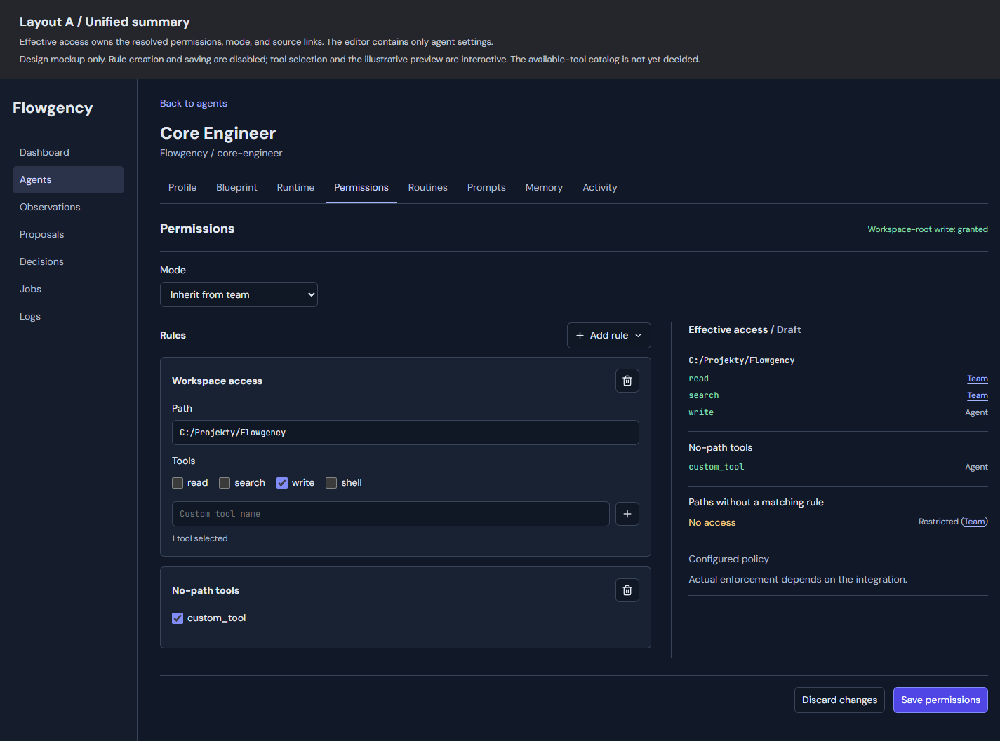
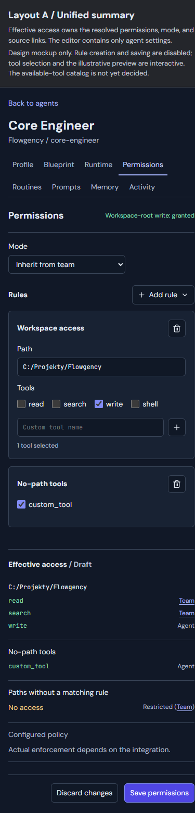
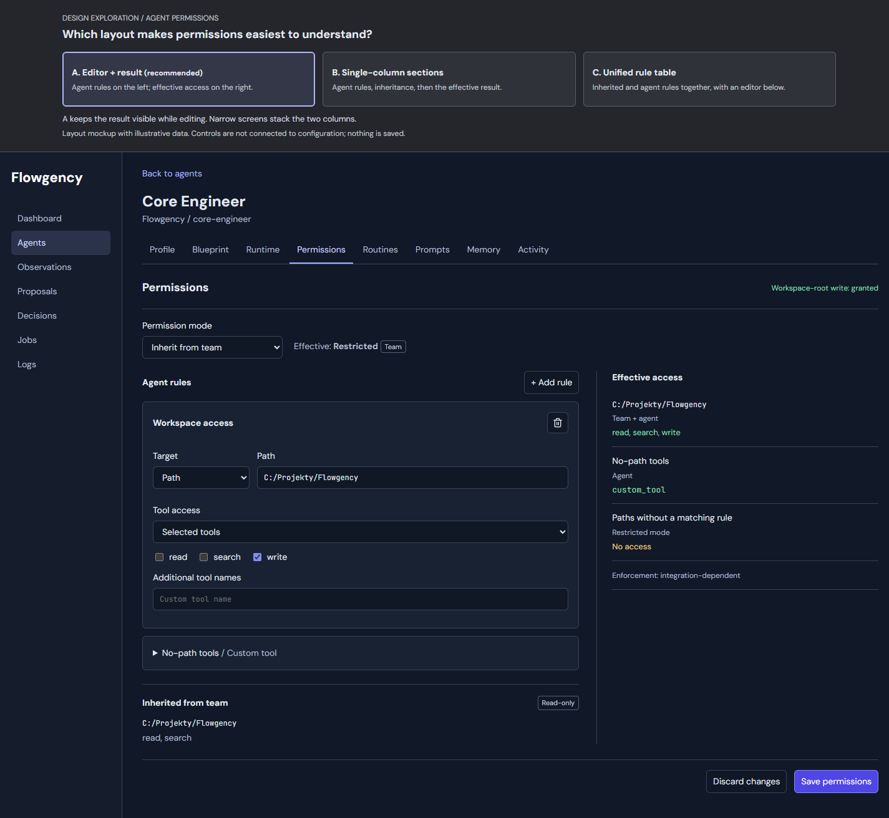
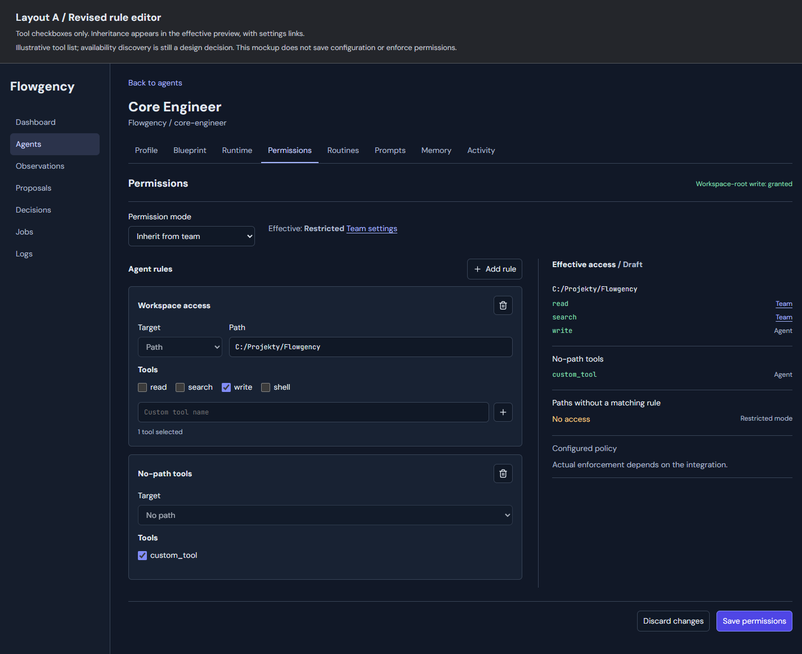
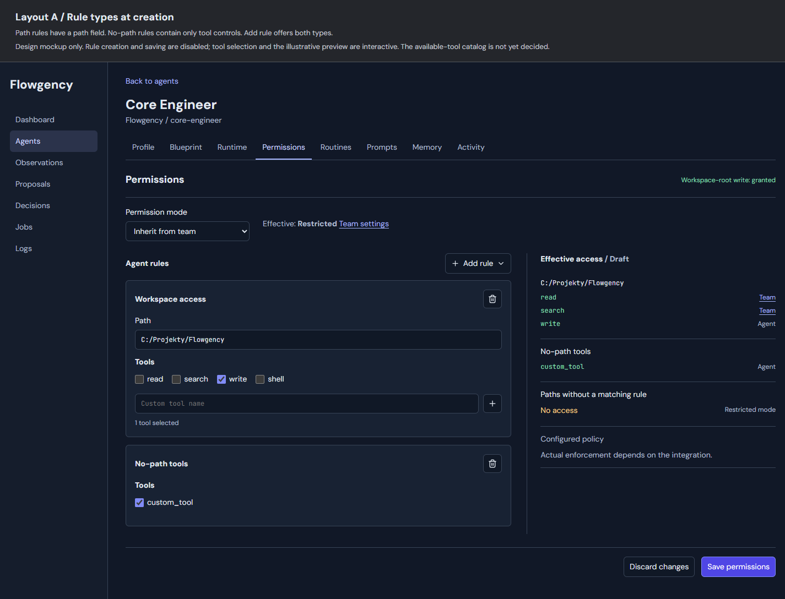
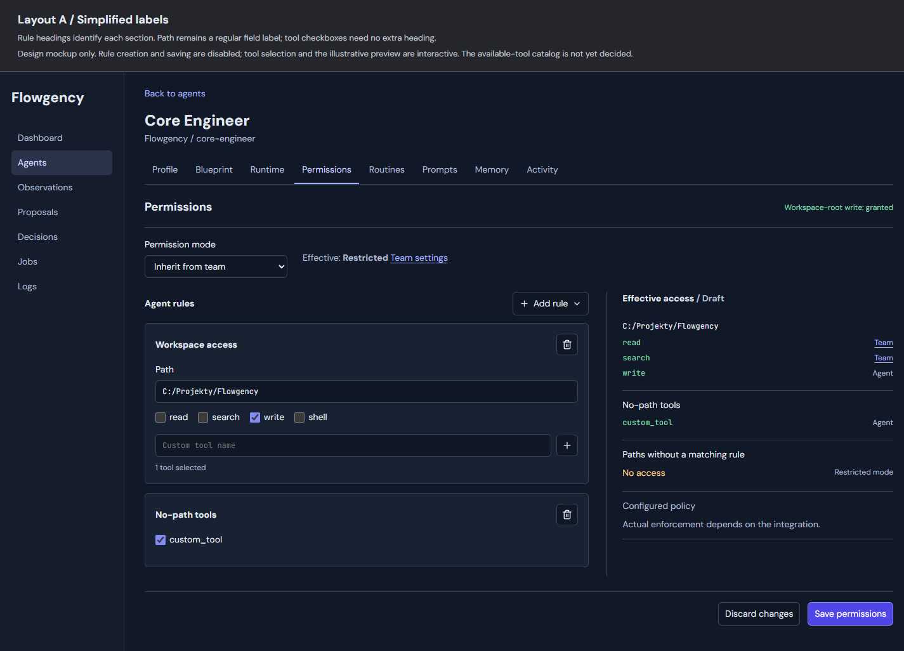
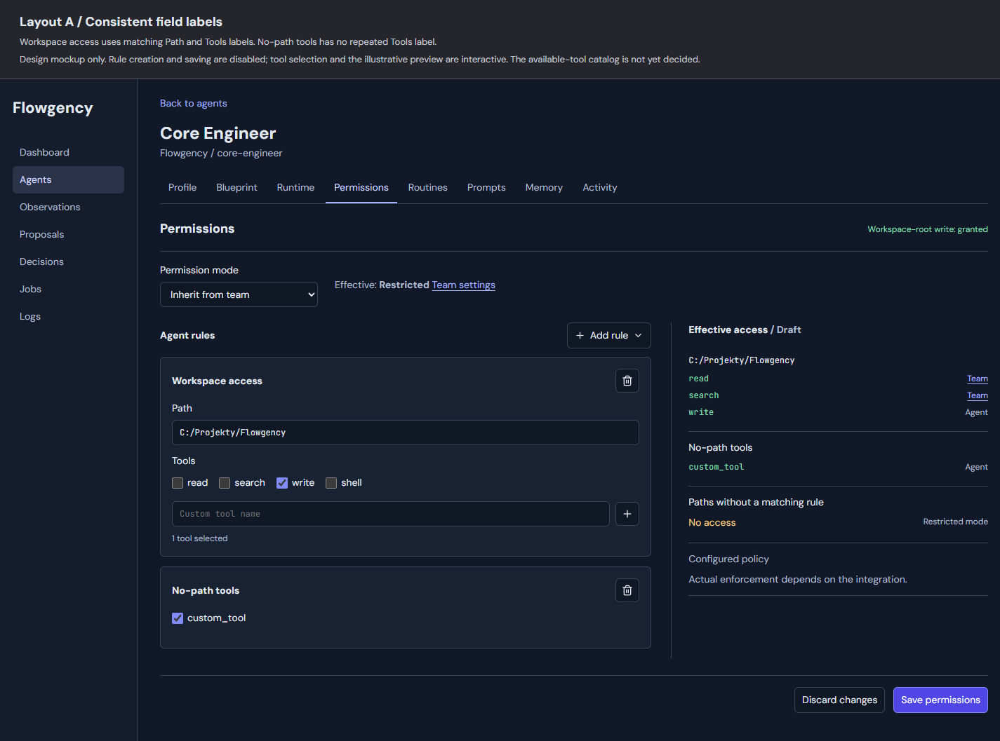

# Agent Permissions UI Design

Date: 2026-09-06

Updated: 2026-09-07 (team and agent permissions moved alongside runtime at user request).

Status: Design and visual direction approved in conversation; written specification awaiting user review.

## Goal and scope

Give each configured agent one dedicated **Permissions** tab with a fully structured editor and an effective-policy summary. Operators must not need YAML or knowledge of its optional fields to define permissions.

Keep the existing permission rule structure, policy resolution semantics, validation constraints, and enforcement semantics. At the user's request, move both team and agent `runtime.permissions` to a sibling `permissions` block alongside their respective `runtime` blocks. This is an intentional configuration-model change at both levels; redesigning the team permission UI remains out of scope. The user also approved read-only available-tool metadata supplied by integrations. This is not an integration settings editor or a change to what integrations enforce.

In scope:

- Agent permission rules and the existing agent-level mode override.
- Relocation of team and agent permissions alongside runtime, including the corresponding model, reader, writer, validation, example, and test updates. Adapt existing Team Settings persistence without changing its visible controls or behavior.
- All existing rule shapes: path-bearing and pathless, explicit tool names, unbounded tools, and empty tool lists.
- Read-only effective access with per-tool provenance and team settings links.
- Removal of the misleading Profile write checkbox and permission editing/preview from Runtime.
- Preservation of existing grants, validation failures, concurrent edits, and unrelated configuration.

Out of scope:

- Redesigning team permission editing or adding controls to Team Settings. Its model bindings and persistence must be updated for the team-field relocation.
- Integration selection/configuration, CLI permission enforcement, or new tool capabilities.
- New permission semantics, deny rules, automatic configuration migration, or startup conversion. The explicitly requested team and agent field relocations are in scope.
- Changes to agent blueprints, prompts, routines, memory, dispatch, jobs, or decision execution.
- A YAML editor or advanced schema-oriented mode.

## Approved visual contract

The final approved source is [permissions-short-labels-v7.html](assets/2026-09-06-agent-permissions-ui/permissions-short-labels-v7.html). Its application region is normative for layout, ordering, labels, and visual hierarchy. This document governs behavior. Earlier revisions below are historical only.





Asset directory: `docs/superpowers/specs/assets/2026-09-06-agent-permissions-ui/`.

The comparison/brainstorming banner is not application UI. Sample team names, paths, tool names, and permission grants are illustrative data, not defaults or a hard-coded tool vocabulary. Disabled mockup controls become functional in the application. The mockup's simplified JavaScript is not a production policy resolver. Its note that tool metadata is undecided is superseded by the approved metadata contract below.

### Navigation and ownership

- Add **Permissions** immediately after Runtime in Agent Detail navigation.
- Remove the Profile **Write capability** field and the copy claiming that Profile edits it. Profile owns identity only.
- Remove permission rules, inherited permission text, and effective permission preview from Runtime. Keep integration information and timeout settings there.
- Team configuration stays on its current settings page; the summary links there without embedding an editor. Existing Team Settings reads and writes use sibling team `permissions`, while its timeout setting remains under team `runtime`.

### Page structure

- Page heading: **Permissions**, with the derived workspace-root write status shown in the approved position. Derive it through existing eligibility logic, never from a separate editable boolean.
- **Mode**: an agent selector with **Inherit from team**, **Restricted**, and **Unrestricted**. There is no separate effective-mode explanation beside the selector.
- Two columns: **Rules** on the left, **Effective access** on the right. At narrow widths, stack editor then summary. Preserve the application's existing theme, typography, and responsive navigation.
- No separate inherited-rules section. All inherited information belongs in the effective summary, with source links.
- **Discard changes** and **Save permissions** at the bottom. Indicate the draft state in the summary when there are unsaved changes.

### Rule controls

- **Add rule** offers **Path rule** and **No-path rule**. The choice creates the appropriate rule shape; do not repeat it in a Target selector on every rule.
- A path rule has an editable **Path** field, a **Tools** label, tool checkboxes, custom-tool entry, selection status, and an icon-only remove action with an accessible name and tooltip.
- **Path** and **Tools** use matching normal-weight field-label typography. The rule heading remains bold. The workspace-root rule may be titled **Workspace access** as in the mockup; other path rules use **Path rule**. These are derived presentation labels, not new configured names.
- A no-path rule is headed **No-path tools** and has tool controls and removal. It has no Path field, Target selector, or redundant Tools label. It supports custom tool names just as a path rule does.
- There is no All/None/Selected selector and no separate All tools toggle. All available choices are tool checkboxes.
- New rules start with no tools checked. A new path rule requires an entered path before saving. A blank path must not silently become a no-path rule or the workspace root.
- Accept absolute and relative paths under existing validation. Preserve authored relative text; the summary shows resolved paths. Creating a rule must not create or modify anything at that target path.
- Preserve existing rule order and separate list entries, including repeated paths and multiple no-path rules. Do not silently combine the editable source rules because the effective summary combines them.
- Changing rule type is accomplished by removing the old draft rule and adding the other type; Discard restores the loaded configuration. No additional conversion selector is required.
- Custom tool names remain text-safe values. Adding a name creates a selected checkbox. An existing name is selected rather than duplicated. Unchecking removes its explicit grant; the UI must not discard configured names merely because metadata does not advertise them.
- Empty rules and an empty rule list are meaningful and supported. Removing a rule deletes that entry, not its contents. Clearing all tools keeps the entry with an empty tool list.

## Available-tool metadata

The current `RuntimeCapabilities` describes permission modes and path-scopable tools, not a complete tool catalog. Do not treat `path_scopable_tools` or the mockup's read/search/write/shell examples as an exhaustive vocabulary.

Add a small, read-only integration-facing catalog contract, separate from effective permissions. It supplies canonical permission tool identifiers, display ordering, applicable rule targets where known, a catalog identity/version, and whether the catalog is complete. Path-scopability is separate metadata: availability never implies that a tool can be enforced on an individual path.

The catalog must come from evidence about the integration's tool vocabulary, not from a guess or the set of tools already granted by configuration. A dynamically extensible integration must not declare a closed catalog complete when extension tools are unresolved. Enumeration failure produces an incomplete/unavailable catalog, not a successful empty catalog.

The editor combines catalog choices with existing configured and newly added custom names. Preserve names unsupported by the current integration for configuration fidelity; existing policy validation determines whether a requested policy can run. Catalog metadata does not reject or grant tools by itself.

Use the same catalog snapshot for display, preview, and save mapping. Resolve it on the server; never trust a browser assertion that every tool is selected or the catalog is complete. A changed catalog invalidates automatic all-tools mapping and requires a refreshed preview before saving, with the draft retained. Metadata lookup must not run a job, alter integration configuration, request credentials, or add unrelated tool-discovery infrastructure.

### Automatic configuration mapping

Both team and agent configuration use `permissions` alongside `runtime`; `permissions` retains `mode` and `rules`, and each rule retains optional `path` and `tools`. Both `runtime` blocks contain timeout settings, not permissions. This team excerpt illustrates the new locations (global configuration is omitted):

```yaml
teams:
  flowgency:
    name: Flowgency
    workspace_path: C:/Projekty/Flowgency
    path: C:/Flowgency/teams/flowgency
    default_integration: copilot
    runtime:
      timeout: 1800
    permissions:
      mode: restricted
      rules:
        - path: .
          tools: [read, search]
    agents:
      - name: core-engineer
        blueprint: core-engineer
        integration: copilot
        runtime:
          timeout: 2400
        permissions:
          rules:
            - path: .
              tools: [write]
```

Omitting agent `permissions.mode` continues to inherit team `permissions.mode`. Agent `permissions.rules` remains additive to team `permissions.rules`; same-path tools are still unioned. Relative rule paths at both levels still resolve against the team workspace. Omitting agent `permissions` means inherited mode and no additional rules; omitting agent `runtime` means inherited timeout. Omitting team `permissions` retains the existing defaults of unrestricted mode and no rules; omitting team `runtime` retains the 1800-second default timeout. In the example, the agent inherits restricted mode, receives read/search/write on the workspace, and overrides only the timeout.

Update team and agent permission consumers and writers consistently, including path resolution, effective-policy construction, instance/compilation inputs, team creation/settings persistence, setup-generated configuration, and validation diagnostics. This is a structural relocation, not a policy change. Do not put a second canonical permissions block inside either runtime block or use an old-field fallback that can hide conflicting configuration.

Reject old nested team or agent `runtime.permissions` with an actionable diagnostic identifying the affected team or agent and directing the operator to move that block to sibling `permissions`, leaving runtime settings untouched. If both locations are present at either level, reject the configuration rather than choosing, unioning, or overwriting one. In particular, the existing permissive runtime extras handling must not silently accept and ignore an old permissions block at either level. Do not rewrite the user's live configuration or add startup conversion as part of this feature. Existing configurations need an explicit operator edit before use with the relocated team and agent fields.

| UI state | Existing configuration representation |
| --- | --- |
| Inherit from team | Omit the instance `mode` |
| Restricted / Unrestricted override | Set `mode` to the selected existing value |
| Path rule | Include its authored `path` |
| No-path rule | Omit `path` |
| No checked tools | `tools: []` |
| A subset of tools checked | Explicit `tools` list |
| All tools checked against a complete, nonempty catalog | Omit `tools` |
| All displayed tools checked against an incomplete catalog | Explicit list, never infer an unbounded grant |
| Deleted rule | Remove that rule entry |

No-op fidelity takes precedence over normalization. If a rule's tool selection is unchanged, preserve its original explicit list or omitted/null representation even when all visible boxes are checked. A path-only edit must not broaden its tool grant. Keep the original raw rule representation on the server, not solely in client-supplied hidden data. Returning a draft to its original state is a no-op. Preserve unchanged field spelling/order and values as supported by the current store; this is structured-data preservation, not a requirement to preserve byte-for-byte YAML formatting.

For a changed tool selection, apply the table above. Empty selections must map to an empty list even if the catalog contains zero entries. Never silently discard an existing unbounded grant or normalize it into a finite list just by opening and saving the page.

An omitted/null tools field is an unbounded grant, including future integration tools. Show that fact in the effective summary; do not reintroduce a schema selector. When a complete catalog is available, show all corresponding checkboxes checked. Where the catalog is incomplete, preserve existing unbounded rules unchanged; an explicit checkbox edit can narrow the rule to the selected finite list, visibly reflected in the draft preview. Creating or restoring an unbounded grant requires a complete catalog. If that cannot be provided for an integration, report the limitation rather than claiming full all-tools editing support or broadening a finite grant. This is an implementation acceptance constraint, not authorization for further permission-model changes beyond the team and agent field relocations or for adding an All tools control.

## Effective summary

Use the existing policy resolver to compute the effective policy from the current team configuration plus the candidate agent permissions. The browser must not reimplement policy merging or enforcement.

- Show canonical resolved path scopes and their effective tool grants.
- Show no-path rules separately, as configuration for tools without a path. Do not imply that they grant access to every filesystem path.
- Annotate individual tools with **Team**, **Agent**, or both. Team attribution links to `/admin/teams/{team}/edit`; build links from the actual team, not the mockup's sample ID.
- For a merged unbounded grant, identify the source of that unbounded grant instead of attributing unknown/future tools to an explicit finite list.
- Preserve longest-matching-path semantics. A nested rule governs its own region; do not display it as another same-path union with the parent. Compute attribution alongside the existing resolved result without replacing the resolver with a second policy engine.
- The unmatched-path row shows the fallback access and effective mode, with **Team** linked for inheritance or **Agent** for an explicit override. Do not duplicate this alongside Mode.
- Separate configured access from actual integration enforcement. Available metadata is not a sandbox guarantee, and existing validation must continue to reject unsupported policies.
- The workspace-root write status uses existing eligibility semantics: a matching explicit workspace-root grant, not a write grant only on a subdirectory and not merely unrestricted fallback.
- Flowgency-owned launch protections and reporting/memory behavior remain unchanged. This pre-launch summary must not fabricate a launch path or represent generated job-specific rules as operator-editable grants.

## Application boundaries and data flow

Keep new permission form/preview logic in a focused module rather than growing unrelated agent-detail handlers. Reuse existing team/agent lookup, templates, validators, config-store locking, and policy-resolution APIs.

Suggested ownership, without prescribing unnecessary framework changes:

1. Integration tool catalog: read-only tool descriptions and completeness, independent of policy enforcement.
2. Permission form adapter: decode structured fields, preserve original rule shape, map changed selections, and produce field-addressable validation errors.
3. Permission preview presenter: invoke the existing resolver on an in-memory candidate and annotate provenance for the summary.
4. Permission configuration patch: change only the selected instance's sibling `permissions` block using the existing revision-checked store; never write agent `runtime.permissions`.
5. Agent Permissions routes/template/client script: rendering, editing, asynchronous preview sequencing, and save/discard states.

Existing team configuration patches must write sibling team `permissions`, preserve team `runtime.timeout` and all agent entries, and never reintroduce team `runtime.permissions`. Agent Permissions saves remain isolated to the selected agent; they do not edit team defaults.

Expose GET and POST at `/{team}/agents/{agent}/permissions`, plus a read-only POST preview endpoint beneath that route. POST here describes the request method, not a persistence operation: preview only operates on an in-memory candidate and never writes configuration. Use structured form/JSON parsing, not an editable YAML payload.

On load, retain the loaded config revision, original raw agent rules, and catalog identity. Initialize the form from raw authored values so resolved paths do not replace relative input. Compute the initial saved-policy summary on the server.

On edits, debounce preview requests and associate every request with a monotonically increasing draft version. Mark the summary pending immediately. Ignore any response that no longer matches the latest draft. Invalid input or an unavailable resolver/catalog must not leave an older success summary presented as current. Preview shares serialization and validation with save; it is not a substitute for save-time validation.

On Save, compare the expected revision under the existing lock, load the matching baseline, apply only the agent permissions patch to raw configuration, validate the full candidate and effective policy, and replace atomically. Also verify the catalog identity used for all-tools inference. Return the existing POST/303-redirect flow on success, refresh services, and render the newly saved policy.

Do not let the old Runtime POST remain a second permission writer. Keep timeout submissions working; reject old permission-rule fields with an actionable error rather than silently applying or discarding them. Removing fields from the Runtime form must never erase configured permissions. The Profile identity POST must likewise leave permissions untouched.

## Error and interaction behavior

- Field errors identify the affected rule/path/tool or Mode selection and retain the full draft, including custom names and newly added rows.
- A config revision conflict blocks overwriting newer changes. Keep the draft visible, offer reload/discard, and never retry with the new revision automatically. No silent merge of independently edited policies.
- Catalog changes and temporary preview failures are distinct from invalid user input. Retain edits and permit retry when the relevant dependency recovers. Never infer an unbounded grant from missing metadata.
- Save validates again even after a successful preview. Disable duplicate submission while saving and communicate failures without losing the draft.
- Discard restores the loaded agent configuration and saved summary. When a conflict makes that baseline stale, explicitly reload the current configuration instead of calling the stale baseline current.
- Warn before leaving with unsaved edits. Team source links may open a separate tab, as in the approved sketch, so inspecting team settings does not discard the draft.
- Icon actions have accessible names and tooltips. Checkbox groups retain accessible names even when there is no visible Tools label. The Add rule menu supports keyboard operation, focus restoration, and Escape.
- Match both supported themes, constrain long paths/tool names, and retain stable controls without horizontal page overflow on narrow screens.

## Verification and acceptance

Use focused tests while implementing and run the complete suite before review and integration, per the repository workflow. Compare rendered implementation screenshots against the final archived desktop and narrow-layout images before claiming UI completion.

Required focused coverage:

- Team and agent sibling `permissions` accepted; old nested permissions and both-location conflicts rejected with relocation guidance at either level; no automatic live-config rewrites.
- Equivalent effective policy, mode inheritance, relative path resolution, and eligibility before and after explicit team and agent field relocations; configuration producers emit only the new locations.
- Existing Team Settings and team creation read/write sibling team permissions while preserving timeout, agent configuration, and unrelated data; no team UI redesign or changed defaults.
- Dedicated tab navigation; removal of the Profile checkbox and Runtime permission surfaces; continued identity and timeout editing without permission changes.
- All three Mode values, including clearing an override without losing rules or other runtime fields.
- Absolute and relative paths, pathless entries, empty tools, empty rule lists, arbitrary custom names, repeated paths, and duplicate no-path entries.
- No-op round trips preserving omitted/null versus explicit tools, original relative path text, untouched rule order, and path-only edits without grant widening.
- Complete versus incomplete/unavailable/empty catalogs; changed catalog identity; supported-target metadata; preservation of configured names outside the catalog.
- Automatic all/subset/empty mapping, unbounded-grant preservation, and no automatic broadening from a partial tool list.
- Same-path team/agent unions, overlapping parent/child rules, per-tool source attribution, mode inheritance, and correct team settings links.
- Existing executor-eligibility and unsupported-integration policy behavior remain unchanged.
- Preview performs no writes, ignores out-of-order responses, and never presents stale successful results after a draft error.
- Invalid forms preserve drafts; conflicts and concurrent saves cannot lose unrelated configuration; only the selected agent's permissions may change.
- Safe rendering of path/tool strings and config error text; do not turn these values into markup, scripts, filesystem writes, or arbitrary file editing endpoints.
- Keyboard add/remove/custom-tool interactions, empty states, discard, unsaved navigation, and desktop/mobile layout in light and dark themes.

Baseline established before this documentation-only change on commit `6559632`: `python -m pytest tests/ -q` from the isolated worktree produced **2092 passed, 6 skipped**. This is baseline evidence, not verification of a future implementation.

## Rejected and superseded alternatives

- A YAML fallback or advanced schema editor: rejected in favor of complete structured controls.
- Three-way All/No/Selected tool selectors and a separate All tools toggle: rejected; derive the existing shape from selections with the catalog and preservation safeguards above.
- Separate inherited-rules section: rejected; inheritance belongs only in the effective summary with source links.
- Target selectors inside rules: rejected; choose the rule type through Add rule.
- Repeated Tools label inside No-path tools: rejected as redundant.
- Removing Tools from Workspace access: rejected. Retain it and match the Path label's normal-weight typography.
- Effective mode and settings link beside the mode selector: rejected; place them in the summary.
- Longer labels Permission mode and Agent rules: replaced with Mode and Rules.
- Layout B (stacked sections at all widths) and layout C (unified inherited/editable table): not selected. Desktop uses layout A; narrow screens naturally stack.

## Archived design history

The following sources and renders preserve the conversation's visual decisions. They do not override the final v7 visual contract. The incorrect v4 removal is retained to make its rejection explicit.

### Original layout comparison: A selected

[HTML source](assets/2026-09-06-agent-permissions-ui/permissions-layouts.html)



### Checkbox-only editor and summary-only inheritance

[HTML source](assets/2026-09-06-agent-permissions-ui/permissions-checkboxes-revision-2.html)



### Rule type chosen at creation

[HTML source](assets/2026-09-06-agent-permissions-ui/permissions-rule-types-v3.html)



### Rejected removal of both Tools labels

[HTML source](assets/2026-09-06-agent-permissions-ui/permissions-labels-v4.html)



### Corrected field-label typography

[HTML source](assets/2026-09-06-agent-permissions-ui/permissions-label-weight-v5.html)



### Effective mode moved into summary

[HTML source](assets/2026-09-06-agent-permissions-ui/permissions-mode-summary-v6.html)


### Final shortened labels

[HTML source](assets/2026-09-06-agent-permissions-ui/permissions-short-labels-v7.html) and its desktop/mobile renders are embedded under Approved visual contract.

## Review gate

This commit contains the specification and archived design assets only. Obtain user approval of this written specification before invoking the writing-plans workflow. The implementation plan must restate the normative HTML/PNG paths, then be committed separately before application implementation begins.