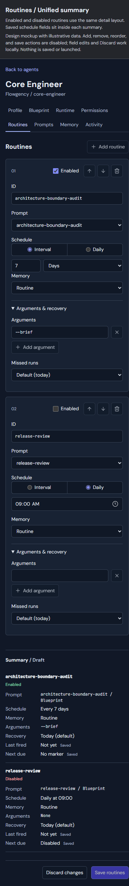
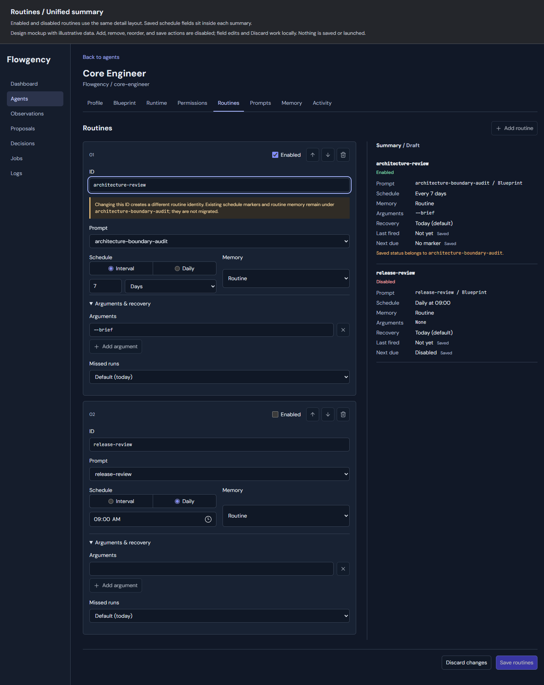
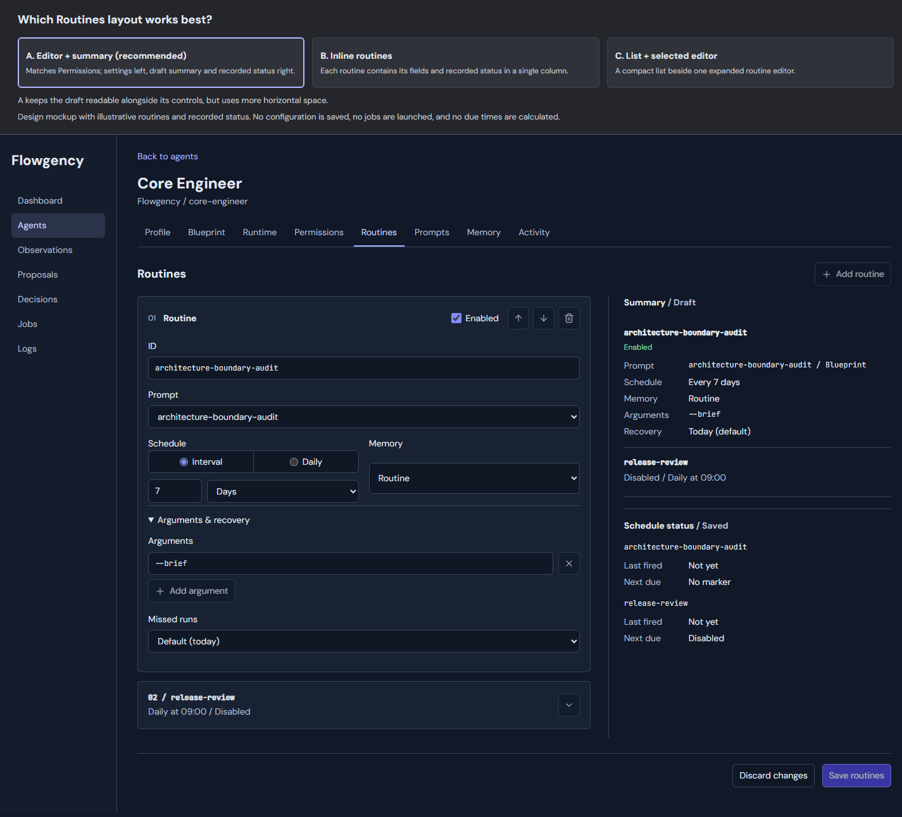
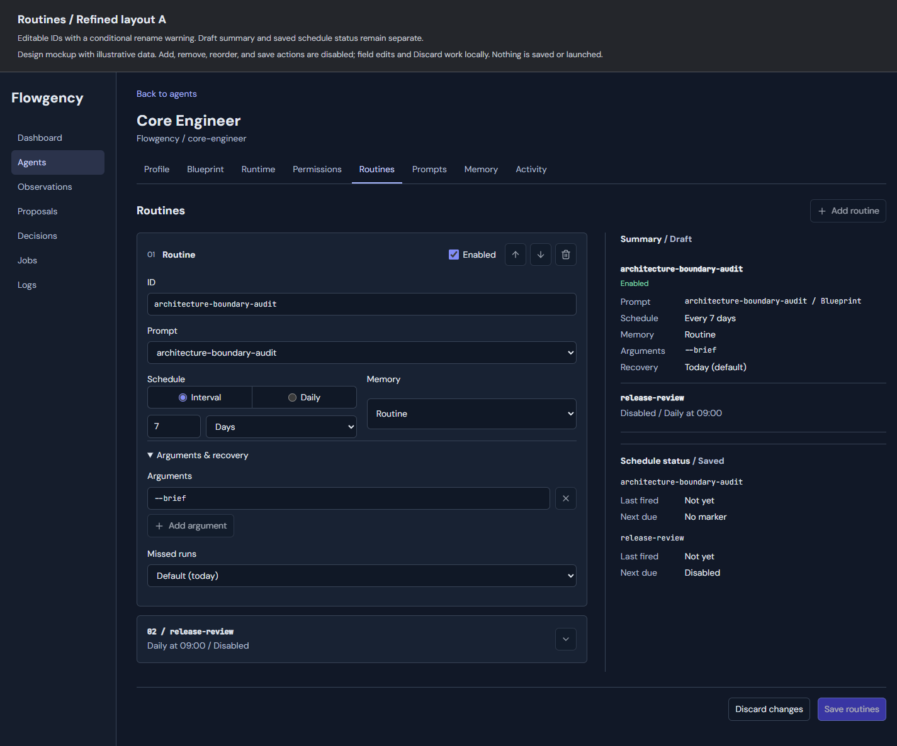
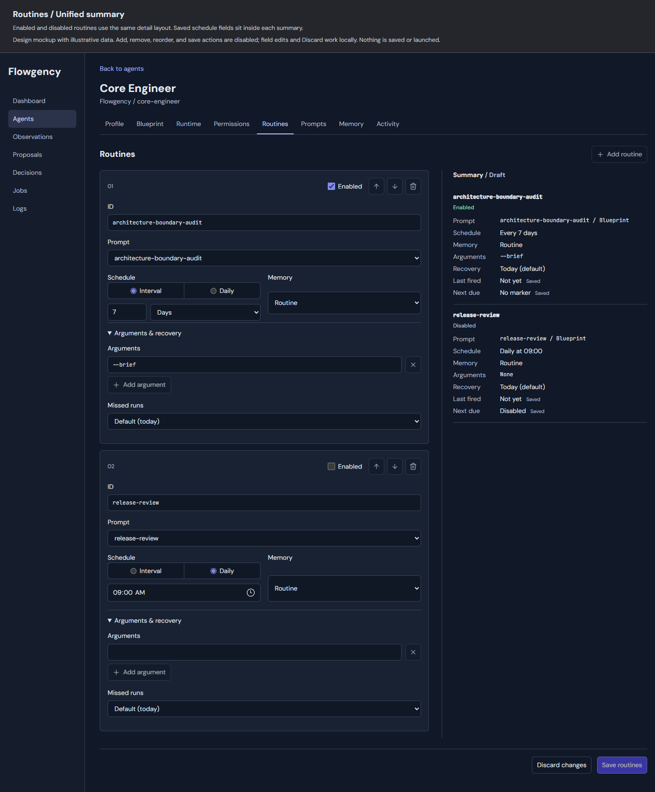

# Routines Configuration UI Design

Date: 2026-09-07

Status: Behavior, final visual revision, and written specification approved in conversation; implementation proceeded on the user's execution request.

## Goal and Scope

Replace the agent Routines YAML/JSON textarea with structured controls. Use the same concise labels, explicit save/discard workflow, and editor-plus-summary arrangement as the Permissions tab. Operators must be able to configure all defined routine fields without editing YAML.

This is a configuration UI change only. Keep the canonical configuration model, scheduled execution behavior, permission policy, and current scheduling/memory semantics. No Run now action, configuration migration, new schedule grammar, or runtime data migration is included.

In scope:

- Add, remove, reorder, enable/disable, and configure the agent's ordered routines.
- Edit routine ID, scoped prompt selection, ordered arguments, schedule, recovery, and memory selector.
- Present draft settings and saved schedule status together, with clear provenance.
- Preserve drafts on errors/conflicts and preserve unchanged authored configuration.
- Replace the agent's raw-source form and redundant prompt/status panels, not the separate Prompts, Memory, or Permissions pages.

Out of scope:

- Team configuration, dispatch controls, integration configuration, and new launching workflows.
- Prompt authoring, job/log redesign, executing or scheduling jobs directly from this form.
- Changing marker paths, clock/timezone rules, recovery semantics, or memory identity.
- Moving or deleting existing markers, memory, logs, or job records when IDs/routines change.
- Editing live configuration while developing the feature, or adding startup conversion.
- A YAML/JSON fallback editor or a general schema/extension-field editor.

## Approved Visual Contract

The final normative source is [routines-disabled-red.html](assets/2026-09-07-routines-ui/routines-disabled-red.html).

Asset directory: `docs/superpowers/specs/assets/2026-09-07-routines-ui/`.

The application region of the final mockup governs layout, ordering, labels, and visual hierarchy. This specification governs behavior. The comparison/brainstorming header is not application content. Illustrative IDs, prompts, paths, arguments, memory channels, and saved-status values are examples, not production defaults. Disabled add/remove/reorder/save buttons in the mockup become functional controls; the mockup's local JavaScript is not the production validator or scheduling engine.

Reuse the existing application shell, icons, light/dark themes, and Agent Detail navigation. Do not add a second page inside the page or copy the mockup sidebar into the template. Earlier assets are archived history, not competing visual requirements.

### Page Layout

- Keep the **Routines** tab and route. The page heading is **Routines**, with an icon-plus-text **Add routine** command.
- Use layout A: the ordered editor on the left, **Summary** on the right. Stack editor before summary on narrow screens.
- Individual routine editors are repeated bordered items with 6px corner radius, not nested section cards. The summary is an unframed column with rows separated by restrained borders.
- Remove the standalone blueprint/instance prompt lists; their distinction belongs in the prompt selector and summary.
- Remove the standalone Schedule status section/table. Each routine summary includes Last fired and Next due directly alongside its other fields.
- Keep **Discard changes** and **Save routines** for the entire ordered list, not separate per-row save operations.
- Do not add visible instructional text about controls, YAML syntax, or keyboard shortcuts. Concise validation and identity-change warnings are allowed where actionable.

### Consistent Routine Presentation

- No generic **Routine** heading inside an editor. Show its ordinal (01, 02, ...) and controls, then its ID field.
- Each row has an **Enabled** checkbox, move-up/down icon buttons, and remove icon button. Disable moves at list boundaries, not based on enabled state.
- Enabled and disabled routines have the same editable fields, summary fields, order, typography, and spacing. Do not collapse, dim, or hide a routine's details merely because it is disabled.
- Summary **Enabled** and **Disabled** labels share 12px type, weight 500, and 18px line height. Enabled is green; Disabled is red. In the approved dark mockup these are `#86dfb1` and `#fca5a5`. Use accessible corresponding colors in the existing light theme; retain the text so state is not conveyed by color alone.
- **ID**, **Prompt**, **Schedule**, **Memory**, **Arguments**, and **Missed runs** are concise normal-weight field labels. Keep label typography consistent rather than mixing headings and field labels.
- Preserve the approved **Arguments & recovery** disclosure. Its contents remain editable regardless of routine enabled state; errors inside it expand it automatically. Both example routines show the same content layout.

## Editing Behavior

### IDs and Identity

Existing IDs remain editable. Use a stable editor-local row key and original row identity separately from the changing ID, so reorder/removal/rename cannot attach errors or saved status to a different routine.

Show a warning only when an existing routine's ID differs from its loaded value. It explains that changing the ID changes routine identity and that existing schedule markers and routine-scoped memory remain under the old ID, without migration. Keep the old ID visible in the warning. Returning to the original ID or Discard hides it. New routines do not receive a rename warning.

IDs remain required, unique within the agent, and subject to existing identifier validation. Do not silently generate a different ID on collision. Reordering does not change IDs, markers, or memory identity. Removing a routine from configuration does not delete associated historical data.

### Prompts and Arguments

Use one Prompt selector with **Blueprint** and **Instance** groups populated from the agent's effective prompt catalog. Retain the scope and name as distinct data even when labels match. Never infer scope from a name or silently substitute a similarly named prompt.

Use ordered individual argument inputs with add/remove actions and order controls when there is more than one argument. One input is one argument; do not split whitespace, parse shell quoting, or concatenate arguments into a shell command. Preserve existing argument order and string contents on unchanged rows. New/edited entries use the current nonempty-string validation. No arguments is a supported empty state; the blank input in the disabled sample is illustrative and must not introduce an empty string into saved configuration.

If a selected prompt disappears or the catalog cannot be loaded, retain the selection and draft and surface the problem. Do not reset the prompt selector to its first option. Revalidate availability at save; missing selections cannot silently become a different valid prompt.

### Schedule and Recovery

The Schedule segmented control offers **Interval** and **Daily**, mapping to existing `schedule.every` and `schedule.at` respectively. A routine has exactly one active schedule mode.

- Interval: integer amount plus Minutes/Hours/Days, mapping to the current `m`, `h`, `d` grammar.
- Daily: a time input mapped to the existing daily-time representation. Use the scheduler's current timezone behavior; do not add browser-local timezone conversion.
- Switching modes changes the active draft schedule only; retain unsaved values for the inactive mode locally so switching back does not lose input. Submit exactly one mode.
- Do not normalize an untouched authored schedule string solely because it is displayed through structured controls.

**Missed runs** supports the existing recovery values:

| UI choice | Configuration |
| --- | --- |
| Default (today) | Omit `schedule.catch_up` for a newly selected default |
| No recovery | `catch_up: none` |
| Today | `catch_up: today` |
| Any age | `catch_up: always` |
| Within a duration | Amount and Minutes/Hours/Days mapped to current duration grammar |

Default and explicit Today have the same current behavior but retain their existing authored distinction on a no-op save. Recovery does not mean replaying every missed occurrence: the existing runner considers at most the most recent candidate per cycle. Do not change this policy or add cron/weekly calendar rules.

The current model and form do not validate every timing string as strictly as the scheduler parses it. Handle this boundary explicitly: retain any loaded value that cannot be represented by the structured schedule controls, show a field diagnostic, and never substitute a guessed/default schedule. The operator can correct it using the supported controls. That warning contract is a plain escaped `ValidationIssue.message` string that includes the unsupported saved value; no separate shared warning data field or type is required, and the original saved raw configuration remains authoritative server-side. This is not permission to alter the runtime parser or silently clean existing routines on read/save. Preserve unchanged unrepresentable authored data; require a valid supported value when editing that schedule. Tests must cover this distinction rather than claiming the configuration model accepts only the displayed grammar.

### Memory

Offer **Inherit from agent**, **Run**, **Routine**, **Agent**, **Team**, and **Channel**. Channel selection reveals a selector of configured channels. Do not write a channel key for non-channel scopes, and do not substitute a default channel when the selected one is missing.

Inherit maps to no routine-level selector. Use the existing effective-memory selector to show the actual inherited value in the summary: routine selector, otherwise agent default, otherwise the current run-scope fallback. Do not assume agent-scope fallback from the UI label. A supplied channel selector must refer to a declared channel, as required by existing validation.

## Draft Summary and Saved Status

For every routine, enabled or disabled, show the same summary structure:

1. Draft routine ID and Enabled/Disabled state.
2. Prompt with scope, Schedule, Memory, Arguments, Recovery.
3. Last fired and Next due, each with the small **Saved** provenance label from the mockup.

Read saved status through the existing status/marker helpers. Do not calculate a draft next-run prediction in browser JavaScript or fabricate marker history. Preserve existing dispatch-disabled, no-marker, never-fired, disabled, due-now, and overdue behavior. Mockup text such as Not yet and No marker is sample data; existing authoritative status formatter results govern production values.

Saved status is attached to the original loaded routine row, not looked up by whichever draft ID happens to match another routine's saved ID. On rename, show the conditional note **Saved status belongs to [original ID]** in that summary. This identifies the snapshot as old-identity history, not history migrated to the new name. A new routine has no saved status; present that explicitly, without borrowing a matching removed row's history. Removing a draft row removes its summary, not its on-disk history.

Changing enabled state or schedule updates the draft fields but does not alter saved Last fired/Next due until a successful save and reload. The Saved labels make this distinction visible even when a draft-enabled routine's saved next-due state is disabled.

The page may show **Summary / Draft** while unsaved edits exist; no edits means a saved summary. Derived draft details must never be presented as successfully validated while invalid, pending, or based on an outdated response. Validation/preview errors retain the draft and clearly identify affected fields rather than continuing to show an old success result as current.

## Configuration Fidelity and Persistence

The existing `routines` list remains the canonical ordered configuration. There are no new persisted editor IDs, fields, defaults, schedules, or display-only names.

Initialize from raw authored configuration, not only from `Routine.model_dump`, which fills defaults. Preserve unchanged optional-field presence and values: omitted versus explicit `enabled`, `arguments`, memory, and recovery where valid; raw timing strings; argument contents/order; and any existing extra fields allowed on Routine by the current model. This editor does not author unknown extension fields, but must carry them through unchanged on surviving rows instead of dropping them. No-op save must not fill defaults or discard such data.

Use server-loaded original row data and a revision-bound original index/key to identify surviving rows. Never trust a submitted original dictionary as authority. Reordering is expressly supported: original indices may arrive in a new order, must be unique and in range, and must refer to the loaded revision. This differs from the Permissions editor's ordered-index restriction and must not be copied unchanged. New rows have no original identity. Removed rows disappear only from the selected agent's routine list.

Share typed structured draft decoding, validation, and candidate construction between preview and save. Use structured transport, not a YAML string hidden behind the UI. Preserve blank/invalid draft values for correction rather than silently trimming them into different settings or dropping rows. Use shared domain validators and the effective prompt catalog for supported defined fields; do not invent a second scheduler or new validation semantics unrelated to this UI.

Persist the entire list through a locked revision-checked configuration patch, reusing `replace_agent_routines` or a narrowly factored equivalent that permits the required save-time validation within the transaction. Validate current revision and candidate before atomic replacement. Recheck current prompt/channel references before save; the browser's option list is not sufficient validation. Unrelated teams, agents, permissions, runtime, identity, prompts, and global settings remain unchanged.

Keep GET and POST under the existing agent Routines route and follow the application's POST/303 success pattern. A read-only structured preview endpoint may supply validation and summary without writing configuration, launching jobs, creating marker paths, or allocating memory. Reuse the established request sequencing/error conventions from Permissions, but do not generalize both editors into a new framework merely to share small helpers.

## Errors and Unsaved Changes

- Show field-addressable issues for duplicate/invalid IDs, missing prompts, malformed schedules/recovery, invalid arguments, and memory/channel selection. Associate errors with stable local rows across reorder and rename.
- Keep every submitted row, including new/disabled/invalid rows, and its order on failures. Do not rebuild an error page solely from saved configuration.
- A configuration revision conflict blocks overwriting newer data. Retain the stale draft visibly; never replace its baseline revision and silently retry. Offer explicit reload/discard.
- Discard restores the loaded ordered list, field values, enabled states, disclosure/error state as appropriate, and saved summary. If a conflict makes that baseline stale, reload current configuration explicitly rather than calling stale values current.
- Guard navigation with unsaved changes, including pending argument text not yet added. Adding/removing/reordering is local until Save. No implicit autosave.
- Invalidate pending previews immediately on edit; discard out-of-order responses. A response for an old row order, prompt, or ID must not overwrite a newer summary. Discard also invalidates requests.
- Prevent duplicate submission and ensure Save corresponds to the latest draft, with server-side validation repeated regardless of browser preview state.
- A disabled routine remains editable and validated under the existing model; disabling must not discard its fields or bypass structural validation.

## Architecture Boundaries

Keep routine-specific form mapping, summary presentation, routes, template, and client behavior focused. The current `flowgency/web/routes/agent_detail.py` contains `_parse_routines_payload`, `_routines_context`, `_routine_status`, and the routine GET/POST handlers. Move only the newly owned routine logic into a dedicated module if needed; preserve surrounding agent-detail behavior.

Reuse:

- `flowgency/configuration/patches.py::replace_agent_routines` and `ConfigStore` revision/locking/atomic-write conventions.
- Existing prompt catalog resolution for blueprint versus instance prompt sources.
- `flowgency/dispatch/schedule.py` schedule and recovery primitives and existing dashboard status helpers.
- `flowgency/memory/selectors.py::select_effective_memory` for inheritance.
- Existing local icon asset, theme styles, input patterns, and browser-test helpers from Permissions.

Keep the configuration schema, dispatch runner, marker identity, and memory-store algorithms unchanged. Server and frontend changes support configuration editing only; no runtime side effects are part of rendering or preview.

## Verification Criteria

Use test-driven focused changes, then run the complete Python and browser gates before review/completion. Compare actual application screenshots with the final archived source and desktop/mobile renders. Do not update approved assets to mask implementation drift.

Required coverage:

- Add/remove/reorder empty, single, and multiple routines; both boundary moves; duplicate/mutated row identity rejection; preserving list order and extension data.
- ID edits, duplicate IDs, rename warnings, rename-back/discard, old-ID saved provenance, and no migration/deletion of markers or memory.
- Prompt groups, same-name different-scope prompts, missing catalog entries and catalogs changing between load/save.
- Ordered argument add/remove/reorder, spaces and quoting preserved as single argument values, pending/empty entries, and safe rendering of arbitrary strings.
- Daily/interval controls, all duration units, mode switching, unchanged authored schedule strings, loaded unrepresentable values, and all existing recovery forms.
- Memory inheritance including run fallback, all scopes, channel options/missing channels, and no memory writes from preview.
- Equivalent full summary fields for disabled/enabled routines; green/red text with consistent typography; Last fired/Next due integrated with Saved labels, not a separate panel.
- Saved disabled/dispatch-disabled/missing-marker/due/overdue behavior still comes from existing status helpers and is not recomputed from draft values.
- No-op optional-field preservation; saving one agent cannot change another agent or any unrelated configuration; conflicts cannot overwrite newer changes.
- Validation and I/O failures retain full drafts; preview is read-only; stale responses, discard, pending input, and duplicate saves behave safely.
- Keyboard focus for add/remove/reorder/disclosure, accessible labels and error associations, sufficient contrast, visible focus, long IDs/prompts/arguments, and desktop/mobile light/dark layout without overflow.
- No YAML/JSON textarea, extra launch action, generic Routine heading, standalone prompt list, standalone Schedule status section, or enabled-state-dependent detail collapse.

Baseline: on `72a2bd0`, `python -m pytest tests/ -q` from `C:/Projekty/Flowgency/.worktrees/routines-ui` produced **2163 passed, 6 skipped** in 333.11 seconds. This precedes implementation and does not claim future feature verification.

## Rejected and Superseded Alternatives

- Layout B, all-inline with no summary, and layout C, list plus selected editor: not selected. Use layout A; narrow screens stack naturally.
- Raw YAML/JSON fallback: rejected for defined routine fields; preserve unknown fields without exposing a general schema editor.
- Run now: out of scope by explicit user direction.
- Read-only existing IDs: rejected; permit edits with contextual identity warnings.
- Generic Routine heading: removed.
- Different enabled/disabled typography, shortened disabled details, or disabled-dependent collapse: rejected.
- Separate saved Schedule status section: removed; status belongs in each routine summary.
- Muted gray Disabled label: replaced by red, matching Enabled's typography.

## Visual History

These source/render pairs preserve approved intermediate decisions. The final red-disabled revision above supersedes them.

### Layout A Selected

[HTML source](assets/2026-09-07-routines-ui/routines-layouts.html)

### Editable ID Refinement

[HTML source](assets/2026-09-07-routines-ui/routines-editor-refined.html)

### Unified Summary and Equal Details

[HTML source](assets/2026-09-07-routines-ui/routines-unified-summary.html)

## Review Gate

This deliverable contains documentation and archived visual assets only. The user approved this written specification by requesting execution. The implementation plan restated the final HTML and PNG paths and was committed separately before implementation started.