# User-Defined Ticket Workflows

Date: 2026-09-08

Status: Design approved in conversation; written specification awaiting user review.

## 1. Purpose

Replace Flowgency's fixed Observation / Proposal / Decision pipeline with generic
work-item tickets governed by user-defined workflows. Each team-owned workflow
instance has a Kanban board, with one column for each defined state. Agents inspect
the project, perform work when necessary, and advance tickets only when transition
requirements are satisfied.

This delivers the ticket-driven orchestration described in the
[README](../../../README.md), rather than adding a board over the old record types.
The same ticket persists throughout its workflow; observations, proposals, and
decisions are no longer special built-in kinds of work item.

This document specifies behavior and ownership boundaries, not an implementation
plan. The approved sketches are archived with it. Application code has not been
implemented as part of this design work.

## 2. Scope

### Included

- Reusable workflow blueprints in a shared Workflow Library.
- Explicit, team-owned workflow instances and one board per instance.
- User-defined ordered states, transitions, structured preconditions, typed inputs
  and outputs, and qualitative agent criteria.
- A live agent-facing ticket interface with immediate operation results.
- Enforced assignment, per-ticket active-run coordination, and multiple tickets
  per agent run.
- A separate ticket-storage integration family, with a Local implementation.
- Board and ticket inspection, workflow-blueprint editing, and instance settings.
- Replacement of Pipeline navigation and its fixed-domain runtime handling.
- Corresponding updates to jobs, reporting, dashboard/inbox references, setup,
  examples, CLI behavior, tests, and documentation where they depend on the old
  pipeline.

### Excluded

- GitHub and Azure DevOps storage implementations, authentication, and sync.
- Cross-team workflow ownership or cross-team assignment.
- Ticket-event subscriptions that automatically start agents.
- Workflow-defined agent roles, transition executors, or role-to-agent bindings.
- User-driven state changes, drag-to-transition, and force-move overrides.
- Import, conversion, or archive UI for legacy pipeline records.
- Transfer or migration of tickets when a storage selection changes.
- Blueprint releases, per-instance revision adoption, and a Source editor tab.
- A new source-workspace isolation system or transactionality for repository edits.

The implementation can be divided into dependent, reviewable tasks for workflow
and storage contracts, agent access and execution coordination, and UI replacement.
Those tasks form one replacement feature, not independent competing authorities.

## 3. Authority and Ownership

| Surface | Responsibility |
| --- | --- |
| Canonical configuration | Register workflow instances under teams; select blueprint and ticket-storage integration; store provider settings and global library location. |
| Workflow Library | Hold reusable, readable, versionable blueprint definitions. |
| Workflow service | Resolve workflow context, authorize ticket operations, validate transitions, and coordinate execution. |
| Ticket-storage provider | Query and persist operational ticket data with the required atomicity, revision, and idempotency guarantees. |
| Durable job system | Own job submission, queueing, execution identity, cancellation, and confirmed process lifecycle. |
| Team execution workspace | Contain the project agents inspect and modify under their existing runtime permissions. |
| Runtime projections | Expose job-specific instructions and ticket access; never become configuration or blueprint authority. |

The existing canonical configuration remains the sole control-plane authority.
Workflow additions follow the established revision-checked, locked, validated,
atomic configuration-write path. Saving a workflow must preserve unrelated teams,
instances, routines, and settings. No directory-shape discovery or startup
conversion becomes a second source of configuration.

Workflow blueprints are separate from agent blueprints but follow the same source
versus instance distinction. An instance selects a blueprint; it does not copy an
editable private definition that silently diverges from that source.

Ticket storage is not an AI runtime. It must have its own provider contract and
registry, rather than implement unrelated execution methods on the AI integration
base class. Its configuration, validation, availability reporting, and explicit
selection should feel consistent with existing AI integration configuration.

### Workflow Context, Not Permanent Blueprint Binding

A ticket is a generic storage record, not a workflow-blueprint instance. Flowgency
uses the ticket's board membership and current instance configuration to determine
which workflow governs an operation. The record must not embed or pin a blueprint
release as its permanent authority.

The initial UI creates tickets in a selected board. No separate unboarded-ticket
inbox or cross-board transfer workflow is required by this iteration. Retaining a
board association for lookup and isolation does not justify locking settings or
making a ticket inseparable from a particular blueprint definition.

Multiple instances may reuse the same blueprint without sharing tickets. Teams
retain their existing workspace and permission boundaries. A storage root may
serve multiple instances, but their ticket namespaces and operation authorization
must remain distinct.

## 4. Workflow Blueprints

### Definition Contents

A blueprint contains a stable internal identity, display name, description,
ordered state definitions, an initial state, and transition definitions. The
library persists these as readable YAML source files that can be edited in an
external editor and version-controlled.

A state has an internal ID, display name, and presentation color. State order
determines Kanban column order, not allowed transitions. Transitions explicitly
name their source and destination states. Branches and returns to earlier states
are represented by declared transitions; no linear progression is inferred from
column position.

An initial state is required for ticket creation. A state with no outgoing
transitions has no available next transition; Flowgency does not infer special
behavior from names such as Backlog, Review, or Done. The example software-delivery
states in the sketches are sample data, not product constants.

Each transition contains:

- A stable internal ID and editable display name.
- Source and destination state references.
- Structured preconditions over declared input values.
- Typed input and output contracts, including requiredness.
- Qualitative criteria evaluated by the agent.

Blueprints do not assign agents to transitions. An agent's prompts and instructions
provide its intent; workflow rules provide the constraints. Assignment controls
which agent can take a particular ticket, independently of transition definitions.

### Internal IDs and Display Labels

The UI never asks users to edit blueprint, workflow-instance, state, transition,
criterion, or input/output technical identifiers. Generate identifiers when new
objects are created and persist them; do not regenerate them on rename, reorder,
save, or reload. Preserve IDs of existing definitions.

Names and input/output labels are human-readable and editable. Criteria expose
their text only. Selection controls show names or labels while retaining stable
references internally. Label equality alone does not establish identity.

The same logical field can be an output of one transition and an input of a later
one. Reuse must preserve its field identity rather than depend on users typing the
same technical key. Adding or selecting an existing field uses its label; renaming
it must not disconnect preconditions or the downstream use of its values.

Technical identities remain in blueprint and operational data for linking and
validation. A human-facing ticket number remains visible on cards and details;
the decision to hide configuration identifiers does not remove ticket numbers.

### Structured Contracts

The initial editor supports Text, Number, Boolean, and Artifact values. Text values
can hold instructions, descriptions, and summaries; an Artifact is a reference to
supporting material rather than an arbitrary file path for the server to open.

Inputs identify information required to evaluate a transition, drawn from current
ticket data or explicitly supplied information. Outputs identify results supplied
by the transitioning agent. Accepted outputs become available to subsequent
transitions. Historical events retain the values used at the time; changing a
current value does not rewrite earlier evidence or assessments.

Requiredness means that a value of the declared type must be supplied. An absent,
null, or blank-text required value is missing; Boolean false and numeric zero are
valid values. A required Boolean is not implicitly an approval. Requiredness does
not establish a verdict or prove correctness.

The initial precondition editor provides Is present, Equals, and Not equal over
declared inputs. All declared preconditions must pass. Comparisons use the input's
type without implicit string/Boolean/number coercion; a missing value does not
satisfy a comparison by accident. Conditions are declarative, not arbitrary Python,
JavaScript, or shell code evaluated by Flowgency.

Users can supply ticket inputs, including an approval where the workflow requires
one, without performing the resulting transition. If a requirement depends on
human provenance, an agent-provided Boolean or author name is not proof of that
provenance. Recorded actor metadata comes from the operation context.

### Qualitative Criteria and Evidence

For each qualitative criterion the agent records whether it is satisfied and the
reasoning supporting its assessment. It can link the assessment to relevant
inputs, outputs, or artifacts. Every defined criterion needs a positive assessment
for the transition to be accepted; a missing or negative assessment blocks it.

There is no separate `evidence_required` flag. Evidence that must be supplied is
an ordinary required output, such as a test report or review report. Criteria
describe what the agent must assess; output contracts describe what it must submit.

Flowgency validates structure, required values, references, and declared
preconditions. It does not equate a submitted report or a positive verdict with
proof that the report is correct. Qualitative evaluation belongs to the agent and
is inspectable in history. A criterion neither starts a test command by itself nor
implicitly requires a human approval action.

## 5. Blueprint Changes

Preserve the current agent-blueprint model: instances follow the current source,
while an operation records the definition it actually used. Do not introduce an
explicit publish/adopt step or an instance revision selector.

Valid edits take effect automatically. A transition request includes the digest of
the workflow definition it evaluated. If that definition changes before the
request commits, reject the stale request and require the agent to refresh and
reevaluate. Never silently validate an old request against different rules.

Compatibility validation must distinguish a real incompatibility from the mere
presence of tickets:

- Renaming and reordering states preserve their identities and ticket states.
- A change must not leave existing tickets in undefined states or silently map
  them to a differently named or positioned state.
- New transition requirements can leave tickets waiting for additional inputs or
  outputs. That is not a reason to prohibit all blueprint changes.
- Conflicting field definitions or state references produce specific validation
  errors, not automatic rewriting of ticket data.
- Selecting a different blueprint in workflow settings is editable and subject to
  compatibility validation, not a ticket-count lock.

UI edits are validated before publication. An incompatible or malformed external
file edit makes affected workflows visibly unavailable for transitions until it is
corrected. Do not silently execute against a cached earlier definition or present
affected tickets as an empty board. Preserve access to stored data and diagnostics
where possible without inventing valid transitions.

Transition history records the workflow digest and the evaluated transition
contract, display names, inputs, outputs, and assessments needed to inspect the
event after the source changes. These are audit snapshots, not selectable releases
or alternate authority. They must not depend on a disposable compilation cache for
their continued readability.

## 6. Tickets and Operations

### Ticket Data

A ticket contains its stable record identity and display number, title, Markdown
description, current state, optional assigned agent, optional active-run reference,
structured field values, artifact references, a revision token, and history.
Board membership supplies workflow context as described above. Provider-specific
identity or locator metadata must not leak into an agent's workflow instructions
as required storage-specific behavior.

The full identity used for an operation includes the resolved storage binding and
namespace, not only a short ticket number. Two storages or boards can contain the
same local number without becoming the same work item.

### Creation and Editing

Users and agents can create tickets in a chosen board. Creation uses that
blueprint's initial state; it is not a general-purpose user state-setting action.
Users can edit ticket content and inputs and select the assignee. Agents can
inspect tickets, claim work, report results, and request transitions through the
live service.

Agent field updates, result reports, assessments, and transitions all require the
ticket's current assignment and active-run authorization. A general update endpoint
must not provide a way to bypass ownership. Reading another agent's ticket does not
grant permission to mutate it.

User input edits are revision-checked and recorded. Editing inputs while an agent
works does not permit reassignment or silently approve the agent's pending
transition: a stale request must be reevaluated. Form errors and conflicts preserve
the user's unsaved input rather than reporting a save that did not occur.

Only agents can move tickets between workflow states. There is no user transition
button, editable state dropdown, drag-to-move gesture, or force-move endpoint.
Administrative configuration operations cannot be used as an implicit substitute
for moving tickets.

### Transition Sequence

1. The agent obtains current ticket data, its board context, and the current
   workflow definition through the live interface.
2. It acquires or confirms assignment and active work for that ticket.
3. It inspects the current project against the transition requirements. Work that
   is already complete can satisfy a transition without being performed again.
4. It performs any necessary authorized work and prepares the required outputs
   and qualitative assessments.
5. It requests a declared transition, supplying ticket revision, workflow digest,
   storage-binding identity, and an operation ID.
6. Flowgency checks execution identity, assignment, active-run ownership, source
   state, current binding/definition, structured contracts, and assessments.
7. The storage provider atomically commits state, accepted outputs, revision, and
   history, or rejects the operation without changing the ticket.

If requirements are unmet, the agent records what is missing and leaves the state
unchanged through a separate revision-checked report operation. A rejected
transition itself does not mutate the ticket. This does not manufacture a built-in
Blocked column. A user may define such a state and its transitions if it fits that
workflow.

The ticket operation is atomic; the external project is not. Evidence must state
what was inspected, and agents must reevaluate changed conditions. Flowgency does
not claim to atomically snapshot arbitrary project activity with a ticket write.

## 7. Assignment and Concurrency

### Claiming Is Assignment

There is one ownership concept: assignment. Do not add a second per-ticket claim
or expiring assignment lease.

| Situation | Required behavior |
| --- | --- |
| Unassigned ticket | Any configured agent in its team may atomically assign it to itself. Only one competing assignment succeeds. |
| Assigned, idle ticket | Only the assigned agent may start work. The user may reassign it or clear assignment. |
| Assigned to another agent | An agent may inspect it but cannot start work, steal assignment, or bypass ownership through a transition request. |
| Active ticket | Only its owning run performs task operations. Reassignment and user unassignment are blocked. |
| Another run of the same agent | It cannot work on a ticket already active in the first run. |
| Different tickets | Work can proceed concurrently within existing job-pool and runtime constraints. |

Starting work establishes an active-run reference using a trusted job identity and
an atomic ownership check. Claiming an unassigned ticket and starting work can be
one atomic operation; the persisted claim is still assignment, not a parallel
lease. Assignment alone does not mean a run is active.

### Multiple Tickets and Sign-Off

A single agent run can claim and work on multiple tickets, including tickets from
different workflow instances in its team. Each ticket independently records its
active run. Taking another ticket does not create a new durable job.

An agent may stop active work while retaining assignment for a later run. It may
also explicitly sign off its own ticket, clearing its assignment and active-work
reference. Sign-off is optional, not a completion rule. It does not change the
workflow state. An agent cannot sign off a ticket being worked by a different run
as a way to bypass active-work protection.

Assignment persists across transitions, successful run completion, failure, and
cancellation unless it is explicitly changed or the agent signs off. Completing
a ticket does not automatically unassign it.

### Run Completion and Recovery

Clear active-work references only when work has explicitly ended or the owning
run is confirmed stopped. A cancellation request, stale heartbeat, or uncertain
process status is not by itself proof that a CLI and its child processes stopped.
When liveness is uncertain, preserve the protection and report the recovery
problem rather than authorizing a second worker.

Run cleanup handles every ticket that run worked on, preserves assignment, and
checks the active-run identity before clearing it. Cleanup from an earlier run
must not clear a later run's marker.

These guarantees coordinate authorized ticket work. They do not introduce
per-ticket execution worktrees or prevent different tickets from modifying the
same source files. Existing workspace, runtime permission, memory, and job-pool
constraints continue to apply.

## 8. Live Agent Access and Jobs

Agents normally discover work during manually launched or scheduled runs, guided
by their prompts and instructions. Ticket creation or state changes do not
automatically select or wake agents in this iteration.

The live interface supports discovering workflows, querying and reading tickets,
creating tickets, claiming/starting work, updating ticket data, submitting
assessments and transitions, ending active work, and signing off. Agent operations
return acceptance or actionable rejection while the run is still executing.

The workflow service derives team, agent, and job identity from job-scoped access
established at launch, not agent-supplied identity fields. It rejects forged,
cross-team, ended-run, and unauthorized operations. User-facing routes do not gain
agent transition authority simply by accepting a job ID in a request.

Each AI runtime integration must explicitly expose a supported live tool channel.
Transport adapters carry the same service contract without making the runtime or
ticket-storage provider authoritative for workflow rules. Shell access is not an
assumed prerequisite. Where a runtime cannot expose the required channel under its
effective policy, report the incompatibility explicitly before ticket-enabled
execution; do not silently fall back to end-of-run outbox transitions or broaden
workspace permissions.

A workspace-read-only agent can still create/report tickets, assess existing work,
and transition tickets it owns when rules pass. These are control-plane reporting
operations, not grants to edit the execution workspace. Future storage credentials
remain with the storage service, not in agent prompts or a broadly inherited
environment. Enforcement claims must reflect the measured limits of each runtime.

### User Assignment and Run

Changing the assignee combobox saves assignment immediately. Selecting Unassigned
clears an idle assignment. There is no separate Assign button.

The adjacent Run action submits a durable, ticket-focused job for the saved
assignee. Selecting an agent alone does not start work. Run is unavailable without
an assignee or when the ticket is already actively being worked. Repeated
submission must not create duplicate effective work for the ticket.

Assignment saving and job submission are separate operations. A queueing failure
does not roll back a successfully saved assignment. Do not report a job as queued
before it exists durably or mark a ticket Working merely because a request was
submitted. Record submission errors and reconcile any partial ticket/job linkage
idempotently.

Queued jobs recheck current assignment and storage/workflow context before taking
work. A queued request does not authorize work after reassignment or a storage
switch. The agent reads current ticket data when it begins; any embedded launch
context is not permission to act on a stale record.

A committed transition remains committed if the job subsequently fails or is
cancelled. The job outcome is recorded separately; live ticket progress is not
rolled back with the run. Memory publication retains its existing success and
validation rules, independently of accepted live ticket operations.

## 9. Ticket-Storage Integrations

### Provider Contract

Each workflow instance selects a storage integration and provider-specific
settings. The provider contract covers configuration validation, availability,
ticket creation/query/read, revision-checked atomic updates, and duplicate
operation handling. Persistence errors distinguish unavailable storage, missing
records, conflicts, and corrupt data.

The workflow service computes allowed changes. The provider persists them and
enforces the storage guarantees; it does not reinterpret transition criteria.
Agents use provider-neutral ticket operations and do not need integration-specific
instructions or direct access to storage files.

Ticket updates include state, field values, assignee, active-run metadata, revision,
and corresponding history in the same commit. Retrying an accepted operation ID
returns its recorded result rather than performing the operation again. Reusing
an operation ID for a different mutation is an error.

### Local Provider

Local storage uses readable filesystem-backed ticket documents under a configured
root, outside the project's execution workspace. It follows Flowgency's existing
Markdown/structured-metadata approach and keeps a ticket's current data and
history together so they can be replaced atomically.

Cross-process per-ticket locking plus revision checks protects updates. Creation
must allocate identities without collision. Operations on different tickets must
not serialize for the duration of agent work; locks cover persistence operations,
not an entire run. The persisted active-run reference provides execution
coordination between short storage transactions.

Path resolution, namespace isolation, file replacement, and reference handling
must respect the repository's filesystem-safety practices. Do not accept a
user- or agent-supplied arbitrary filesystem path as a ticket identity or artifact
download authority. Avoid exposing configuration files, another team's data, or
runtime credentials through traversal, symlinks/reparse points, or unsafe markup.

An unavailable or unreadable root is not an empty ticket set. Corrupt records must
not be silently skipped, recreated, or overwritten. Failed writes leave the prior
document intact. Derived indexes, if needed, remain disposable and cannot become a
second ticket authority.

### Future Providers

GitHub and Azure DevOps are future ticket-storage providers, not included in this
iteration. Their adapters may require additional coordination or metadata to meet
the contract. Provider limitations must be explicit; they cannot silently weaken
assignment exclusivity, revision checks, or transition auditing. No claim is made
that a remote API supplies these guarantees without an adapter demonstrating it.

## 10. Workflow Settings and Storage Switching

Settings expose the workflow name, selected blueprint, ticket-storage integration,
and provider-specific settings. Local exposes its storage root and an availability
check. Workflow instances belong to the selected team; technical identity and
blueprint-revision controls are absent.

There is no blanket lock based on ticket count. Name, blueprint selection, and
storage settings remain editable for populated workflows. Saving still validates
the configuration, blueprint compatibility where applicable, paths, and a newly
selected storage destination. Validation errors must describe the actual problem,
not say that any existing ticket prohibits editing.

Changing storage switches the board's data source:

- No existing ticket or history is transferred, rewritten, or deleted.
- The board reads the selected destination and its configured namespace.
- A successful read from an empty destination means an empty board.
- Switching back makes the original records available again.
- A failed/unavailable destination is shown as an error, not as an empty board.
- Unrelated name edits do not require a storage migration or become locked merely
  because the existing provider is temporarily unavailable.

Do not introduce implicit migration, directory scanning, or fallback to the old
storage. This rule is separate from the decision not to import legacy pipeline
records.

### Changes During Execution

Agent operations include the storage-binding identity, ticket revision, and
workflow digest that were evaluated. Relevant settings changes invalidate stale
requests. Do not redirect an in-flight operation to a different storage that
happens to contain the same ticket number. The agent must refresh its context and
reevaluate before doing further ticket work.

Cleanup of active work still targets the original storage and ticket identity.
Retain sufficient job-scoped information to attempt that cleanup without resolving
the board's new binding instead. If the original target is unavailable, record the
cleanup problem rather than clearing ownership on the new destination.

Switching settings does not undo source-project edits already performed by a run.
Accepted ticket history and assignment in the original storage remain there.
These constraints do not reinstate the rejected ticket-count configuration lock.

## 11. Approved User Interface

Preserve Flowgency's current application shell and theme system. The sketches use
synthetic data and one dark theme for review; they do not require forcing that
theme on users. These are operational work surfaces, not landing pages.

### Board and Ticket Details

Replace Pipeline's Observations, Proposals, and Decisions links with a Workflows
group containing the team's configured boards. Each instance is a separate board.
Workspace, agents, jobs, logs, memory, and settings remain accessible.

The default ticket layout is board plus a right-side inspector. The inspector can
expand into a dedicated detail view. On narrow screens it uses the available
screen, with a clear return to the board. Cards are not draggable to change state.

Use the approved compact single-row desktop header: workflow title and matching
ticket/working counts on the left; search, assignee filter, and New ticket on the
right. Do not restore the blueprint label, Local provider badge, or healthy-storage
dot. Storage faults are surfaced when actionable, not as permanent configuration
metadata in the board header.

The two counts share typography, icon sizing, muted color, and spacing. The working
count counts tickets with active work, not distinct agents or jobs: one run can
work on several tickets. Both counts remain visible on mobile. The total and
working counts describe the board; column counts reflect the displayed filters.

Cards show ticket number, title, assignee, and run activity separately from workflow
state. The inspector provides Overview, Requirements, and History. Inputs can be
edited; outputs and past transition results can be inspected. The assignee selector
saves immediately, with a separate Run button on the same row. An assignment save
must not discard an unsaved ticket-input draft.

Refresh committed ticket changes without losing selection, filters, or unsaved
form input. Keep server revision conflicts and operation errors visible and
actionable. Do not display an unconfirmed mutation as a successful state change.

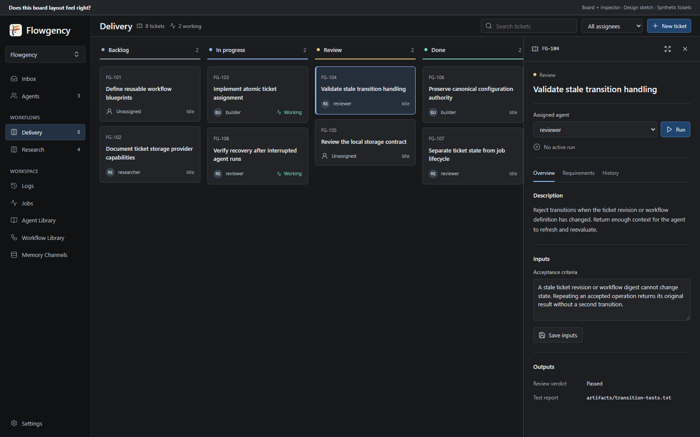

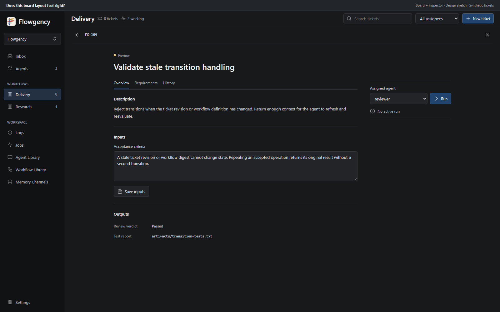

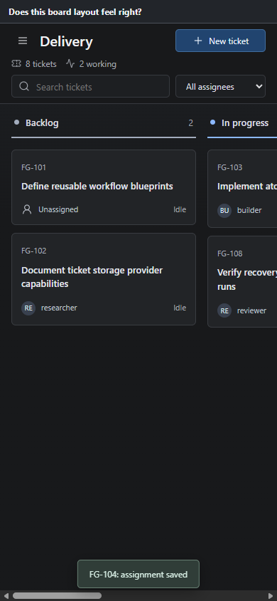

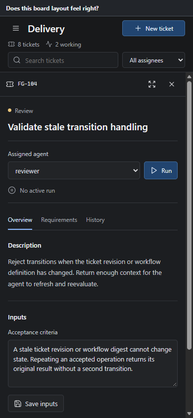

### Workflow Library Editor

The shared Workflow Library owns blueprint authoring. Its editor has exactly
Overview, States, and Transitions tabs; there is no Source tab.

- Overview edits the human name and description and shows referencing workflows.
- States edits names and colors, selects the initial state, and controls column
  order. Reordering never changes tickets' states or transition references.
- Transitions selects a transition and edits its name, From/To states,
  preconditions, input/output contracts, and qualitative criteria.
- Preconditions select readable input labels, not raw technical keys.
- Input/output rows expose label, type, and requiredness.
- Criteria expose text, without identifier fields or Evidence required toggles.
- Save and revert act on the definition draft. Invalid edits do not overwrite the
  saved definition, and external changes use revision/digest conflict detection.

No identifier fields are shown in any of these tabs. New objects receive stable
internal identities automatically. The mobile transition picker replaces the
desktop transition list without changing the available operations.

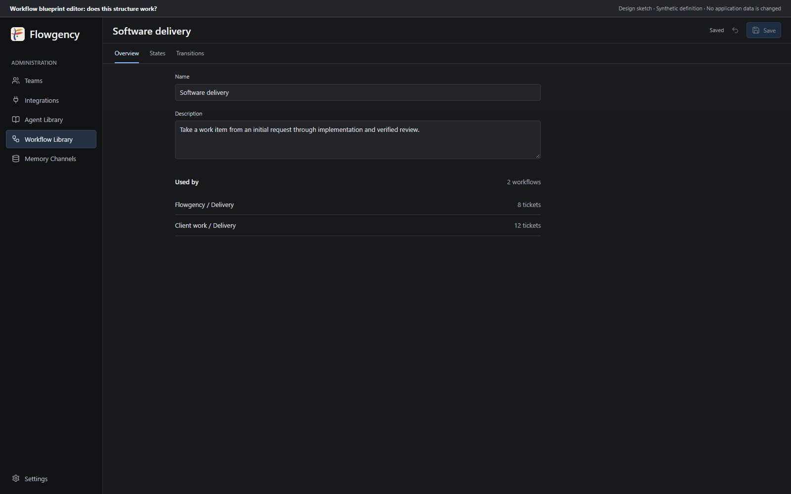

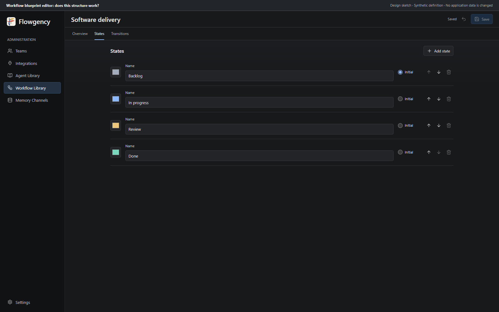

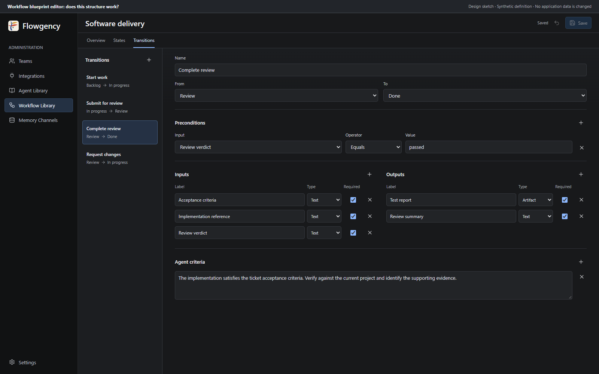

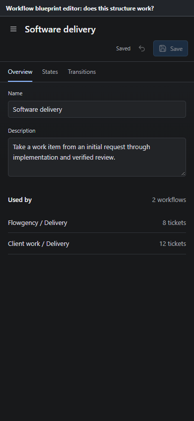

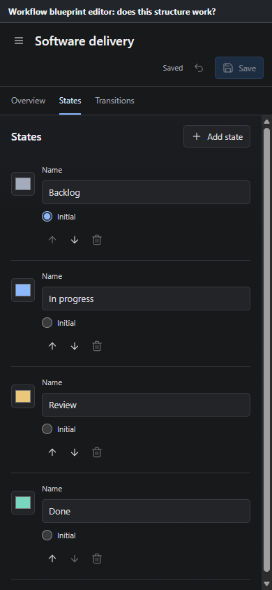

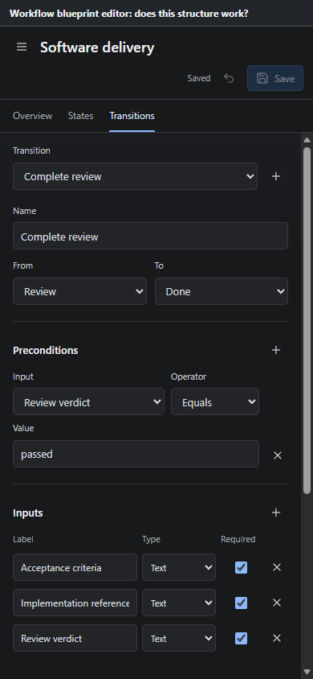

### Instance Settings

The workflow creation action is available beside Workflows. Settings provide the
instance name, blueprint selector with a link to its editor, Local integration
selector, storage root, and Check storage. Provider settings and health belong
here, not in the normal board header. Existing tickets do not disable these fields
or produce a generic in-use note.

Settings saves are explicit and revision-checked. Creation generates an internal
instance ID rather than requesting one from the user. Links between board,
settings, and blueprint editor preserve the relevant team and workflow context.
Only Local appears as an available ticket-storage integration in this iteration.

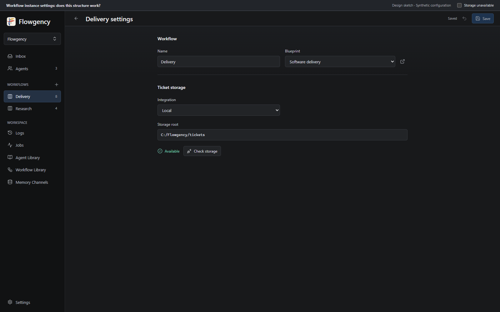

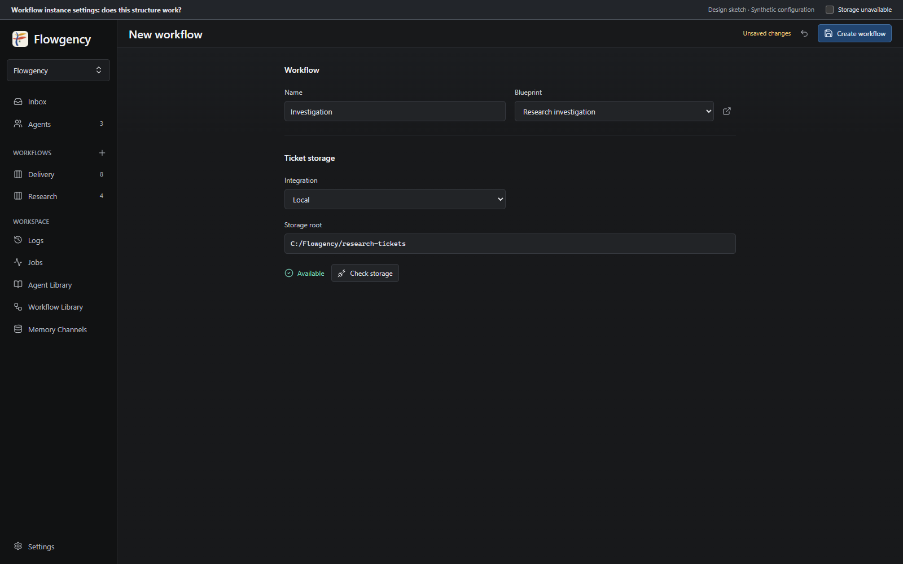

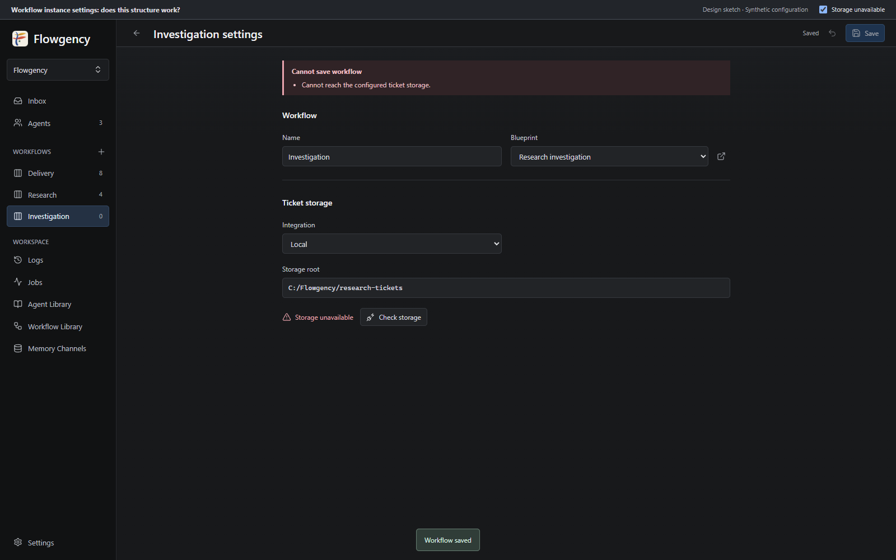

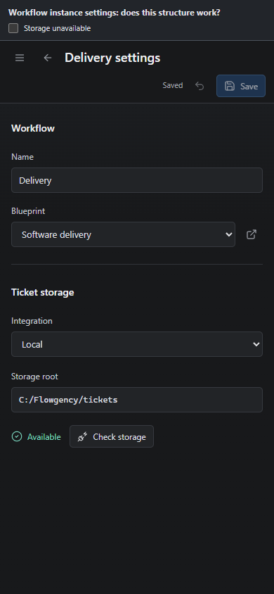

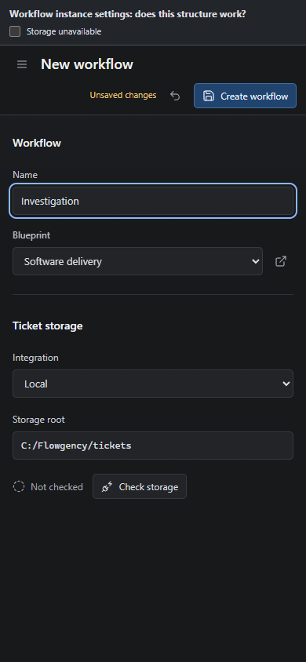

### Asset Authority

The approved asset directory is
`docs/superpowers/specs/assets/2026-09-07-ticket-workflows/`.

Archived HTML sources:

- [Board and inspector](assets/2026-09-07-ticket-workflows/board-inspector.html)
- [Workflow blueprint editor](assets/2026-09-07-ticket-workflows/workflow-blueprint-editor.html)
- [Workflow instance settings](assets/2026-09-07-ticket-workflows/workflow-instance-settings.html)

The HTML and PNG files preserve the reviewed sketches. Their layout, ordering, and
copy are normative for the surfaces shown; this specification is normative for
behavior. Preview-only sample data, simulated saves/health checks, the companion
review banner, and stub navigation are not production behavior or an authoritative
schema. The implementation must wire those surfaces to real validated operations.

The implementation plan must restate these asset paths and require comparison of
rendered results against them before UI completion is claimed.

## 12. Clean Replacement

Retire the fixed observation/proposal/decision UI and runtime handling. Do not keep
an archive UI, import command, compatibility loader, or automatic migration for
those records. Leave existing legacy files untouched. Retired routes must not
continue to mutate them or appear as normal navigation targets.

Replace the observation/proposal outbox reporting contract with provider-neutral
live ticket operations. Reporting remains available independently of workspace
write permission. Preserve memory staging/publication and durable job/log behavior
that is not specific to the retired record model.

Remove decision-specific executor assumptions from new ticket work. A reporting or
reviewing agent need not have write access to the entire workspace just to update
a ticket. Runtime permissions still determine the project work it can actually
perform. No origin-agent fallback, implicit execution decision, or old question
type may become a hidden workflow rule.

Audit dashboard/inbox summaries, job details, logs, CLI entry points, setup assets,
agent reporting instructions, examples, and documentation for fixed-pipeline
dependencies. Replace new-work actions and links with ticket equivalents while
preserving unrelated functionality. Historical jobs and logs are not deleted;
retired decision jobs must not silently invoke removed pipeline handling or be
converted into ticket jobs on startup.

Existing user-owned configuration, workspace files, prompts, team-state
directories, logs, and legacy records are not rewritten simply because the
application gains workflows. Setup and shipped examples should produce the new
model. An unconfigured team has an explicit no-workflows state, not a fabricated
board inferred from legacy directories.

## 13. Failure Semantics and Verification

### Failure Rules

| Failure | Required result |
| --- | --- |
| Invalid blueprint or incompatible state reference | Specific validation error; no automatic move or fallback definition. |
| Missing input/output or unmet precondition | Rejected transition with reasons; no ticket mutation. |
| Missing or negative qualitative assessment | Reject the transition without mutation; a separate authorized report can record the unmet criterion. |
| Competing assignment or active run | Only the authorized owner proceeds; competing request receives a conflict. |
| Stale ticket, workflow digest, or storage binding | Reject for refresh and reevaluation; never redirect silently. |
| Duplicate accepted operation | Return the original result without a second mutation/history event. |
| Queueing failure | Keep successful assignment; report the submission failure without phantom activity. |
| Job failure after accepted transition | Keep ticket progress; record job failure separately. |
| Unavailable/corrupt storage | Explicit error, never an apparently empty board or recreated record. |
| Failed atomic write | Prior ticket document remains intact. |
| Uncertain stopped-run cleanup | Preserve ownership protection and report recovery status. |
| Stale config or blueprint-editor save | Preserve draft and unrelated saved data; report conflict. |

### Acceptance Tests

Implementation tests must cover the following behavior, not merely rendered
controls or synthetic JavaScript handlers:

1. Multiple team-owned workflow instances reuse a blueprint without sharing
   tickets, and different blueprints produce different board state columns.
2. Users and agents create tickets in the initial state; only authenticated
   agent-run operations can transition them.
3. Structured type, requiredness, reference, and precondition validation rejects
   invalid requests without partial updates, including valid false/zero values.
4. Qualitative assessments and required output evidence are recorded distinctly;
   no duplicate evidence-required mechanism exists.
5. An agent recognizes already-satisfied project conditions and transitions
   without unnecessarily repeating the work.
6. Competing assignment/start/transition operations cannot produce two owners or
   two active runs, including multiple runs of the same agent.
7. A run can work on several tickets; ending it clears only its own active-work
   markers and retains assignments. Sign-off is explicit and optional.
8. User reassignment and unassignment are blocked during active work, but workflow
   configuration is not locked by ticket count.
9. Queued jobs cannot take tickets using stale assignment or storage authority.
10. Workflow edits, blueprint-selection changes, and storage switches reject stale
    requests; cleanup continues to target the original binding.
11. Storage switching never migrates/deletes records; empty destinations and
    unavailable destinations have different outcomes; switching back restores
    visibility of original data.
12. Atomic write failure, record corruption, revision conflicts, retries, and
    operation-ID reuse preserve history and prevent duplicate application.
13. Hidden generated identifiers remain stable across renaming, reordering,
    adding/removing neighboring definitions, and reloads; field reuse and
    precondition references do not depend on display labels.
14. Ticket and configuration surfaces resist traversal, unsafe references,
    cross-team access, forged actors, XSS, and unintended credential exposure.
15. Live ticket tools work under the declared runtime policies, including a
    workspace-read-only agent. Unsupported channels fail explicitly rather than
    silently using the old outbox behavior.
16. The old Pipeline UI and reporting/decision actions are retired without deleting
    legacy files or regressing unrelated jobs, routines, memory, logs, agents, and
    workspace behavior.

Use focused tests while implementing and run the complete suite before review and
completion, following the repository workflow. Establish a clean full-suite
baseline in the feature worktree before implementation. Live-runtime probes must
exercise the capabilities claimed for installed integrations; deterministic
integration contracts cover supported adapters regardless of local installation.
Do not downgrade authentication, policy, or transport failures into successful
verification.

Browser verification must use actual application routes and synthetic fixture data,
compare with the approved assets, and cover desktop/mobile layouts, keyboard
navigation, labels, focus, matching status indicators, agent-only state changes,
immediate assignment, separate Run, draft preservation, storage errors, and the
absence of Source/identifier/evidence-toggle controls. Verify positive and negative
server paths as well as UI disabling.

The brainstorming sketches have been checked with standalone Playwright for their
simulated interactions and responsive layouts. Those checks establish design
preview behavior only; they are not application implementation or runtime-enforcement
evidence.

## 14. Rejected Alternatives

| Alternative | Decision |
| --- | --- |
| Board as a visualization of existing record types | Replace the fixed domain model with generic tickets and user-defined workflows. |
| Cross-team boards | Keep workflow instances team-owned. |
| Blueprint roles or per-transition agent bindings | Agent prompts supply intent; rules and ticket assignment govern participation. |
| Fully structured-only or natural-language-only rules | Use structured validation plus inspectable qualitative assessments. |
| Ticket events automatically wake agents | Use existing manual/scheduled discovery and an explicit user Run action. |
| End-of-job ticket snapshots and outbox application | Use a live interface with immediate acceptance/rejection. |
| User card moves or force overrides | Only agents perform state transitions. |
| Explicit workflow blueprint release adoption | Follow current valid source with digest-checked operations. |
| A separate claim/lease in addition to assignment | Claiming is assignment; active-run metadata is execution state, not another owner. |
| Assignment as a nonbinding preference | Assignment prevents other agents from starting ticket work. |
| Mandatory sign-off or automatic unassignment on completion | Assignment persists; sign-off is an agent's option. |
| Only one ticket per agent run | One run can work on several tickets. |
| Legacy record import or read-only archive UI | Clean replacement, leaving old files untouched. |
| Permanent blueprint/storage locks when tickets exist | Keep settings editable; validate the actual operation. |
| Automatic ticket transfer when storage changes | Switch source only, with no transfer or deletion. |
| Dedicated ticket page as the default | Board plus inspector is default; full-page expansion remains available. |
| Multi-row desktop header, blueprint/provider badges | Keep a compact single-row header with matching operational counts on the left. |
| Separate Assign and Assign-and-run buttons | Selection saves assignment; Run is a separate explicit command. |
| Editable technical identifiers | Generate stable IDs and expose names/labels only. |
| Source editor tab | Keep source files externally editable, with no Source tab in the application. |
| Evidence required checkbox on criteria | Express mandatory evidence through required outputs. |

## 15. Existing Implementation Anchors

The implementation plan should start from the owning abstractions already
identified, then take only the local reads needed for each task:

- [Blueprint inspection](../../../flowgency/blueprints/library.py) and
  [compiled projections](../../../flowgency/blueprints/cache.py) demonstrate the
  existing current-source and per-job snapshot distinction.
- [Job resolution](../../../flowgency/jobs/resolution.py),
  [submission](../../../flowgency/jobs/submission.py), and
  [execution](../../../flowgency/jobs/execution.py) own launch authority, durable
  jobs, and current post-run reporting/publication.
- [AI integration contract](../../../flowgency/integrations/__init__.py) and
  [run-request models](../../../flowgency/integrations/models.py) bound runtime
  adaptation; ticket storage needs a distinct contract.
- [Reporting protocol](../../../flowgency/records/protocol.py) and
  [record ingestion](../../../flowgency/records/ingest.py) contain the fixed-domain
  reporting assumptions being retired.
- [Application shell](../../../flowgency/templates/base.html) owns Pipeline
  navigation; [Agent Library](../../../flowgency/templates/admin_agent_library.html)
  illustrates the current library surface.
- [Configuration guide](../../../kb/configuration.md),
  [data formats](../../../kb/data-formats.md), and
  [repository workflow](../../../AGENTS.md) identify authority, compatibility, and
  required verification constraints.

## 16. Review Gate

The user approved the conversational design and the final board, editor, and
settings sketches. Review of this written specification is the next gate. After
that approval, write and commit a separate implementation plan before changing
application behavior. Do not combine this documentation commit with implementation
or treat the prototype handlers as production code.