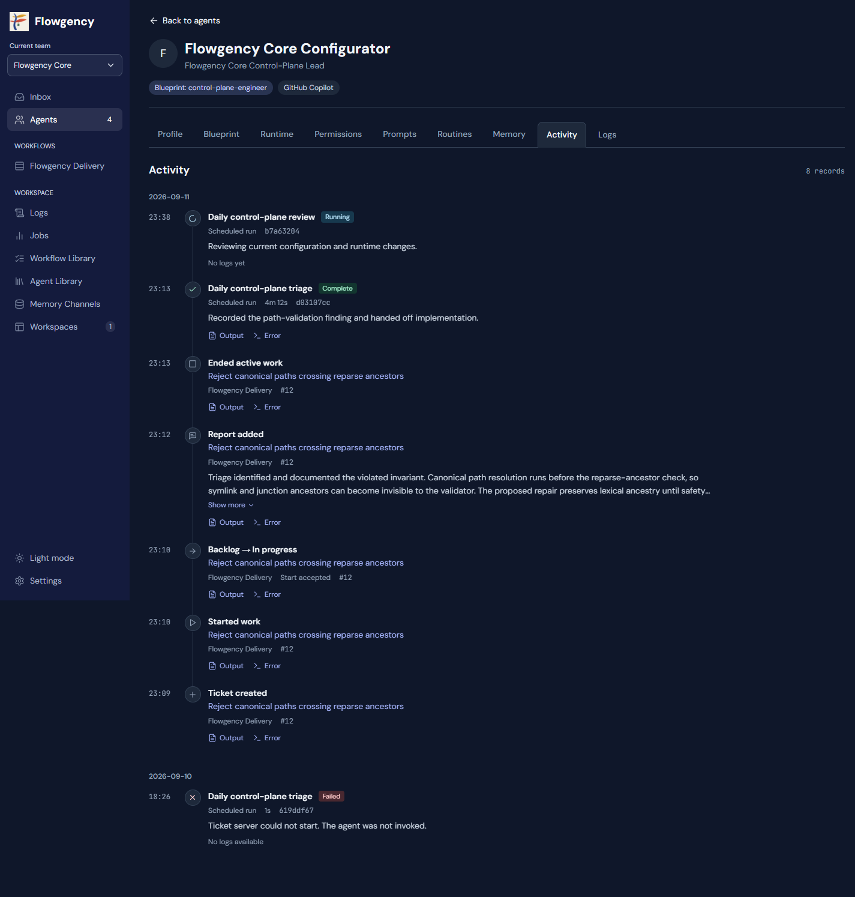
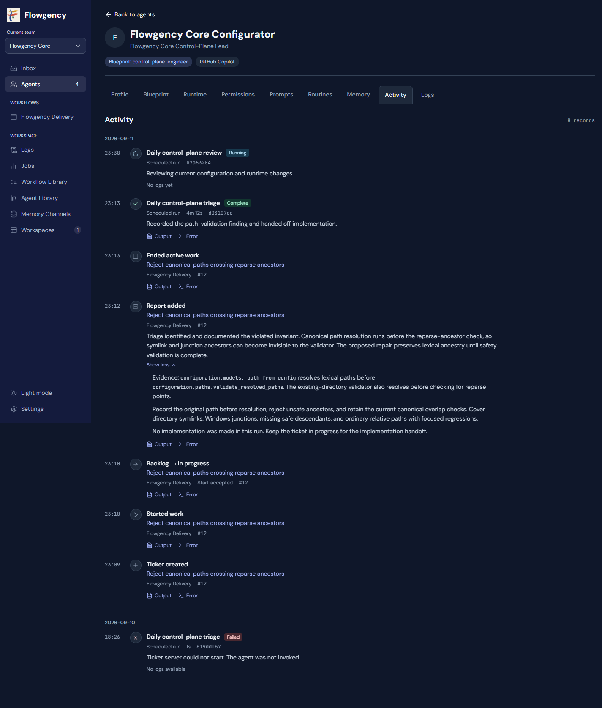
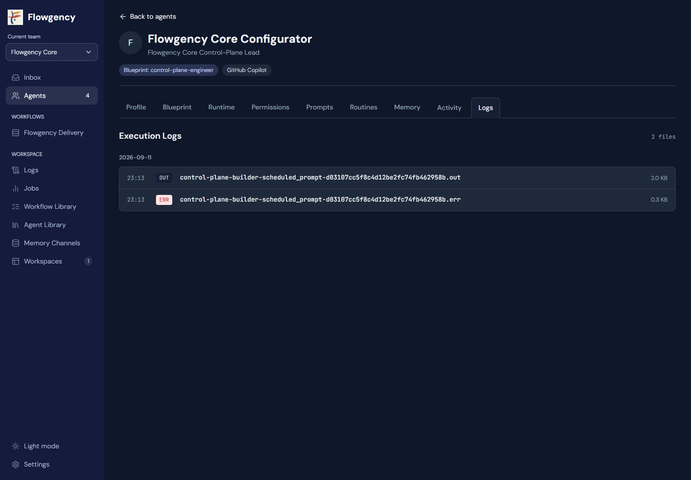
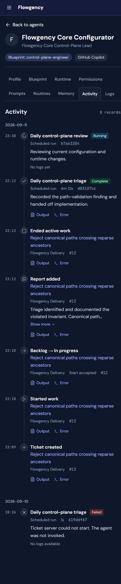
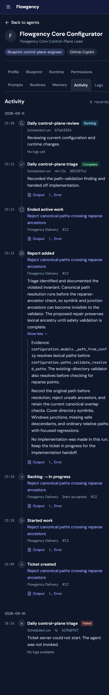
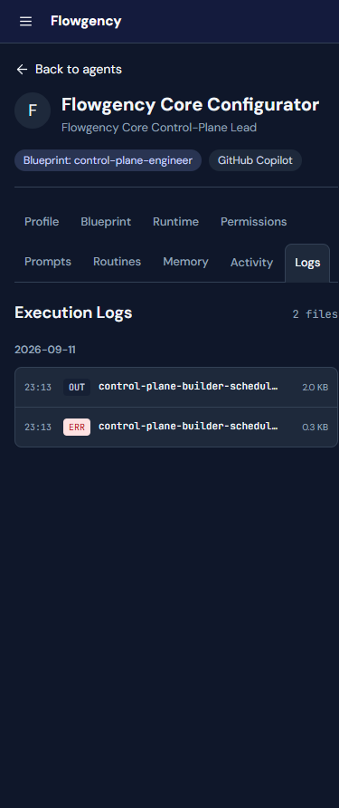

# Agent Activity and Logs

## Goal and Approval

Split Agent Detail's mixed Activity surface into separate **Activity** and
**Logs** tabs. Activity shows runs and ticket events together, newest first,
with direct links to the corresponding output and error logs. Logs shows only
the selected agent's files, using the same presentation as the team-wide
Execution Logs page.

The user selected a combined timeline instead of separate Jobs and Ticket Events
sections, selected direct Output/Error file links instead of a filtered Logs tab
or an intermediate job page, and approved the interactive mockup on 2026-09-12.
This specification records that design for written review before implementation.

This feature is independent of the pending pre-runtime launch-recovery fix. It
does not change when agents run, their instructions, permissions, or schedules.

## Approved Visual Reference

Archive directory: `docs/superpowers/specs/assets/2026-09-12-agent-activity-logs/`.

- Source: [agent-activity-logs.html](assets/2026-09-12-agent-activity-logs/agent-activity-logs.html).
- The source opens locally with its archived DM Sans and JetBrains Mono fonts and
  relative references to the existing Flowgency logo and Lucide icon library.
  Original font licenses accompany the font files.
- Only asset URLs were changed when archiving the approved source. No preview
  server, session key, external font request, or running application is required.
- The screenshots are normative for layout, tab ordering, labels, spacing,
  information hierarchy, and report/link placement. The prose below governs data
  selection, attribution, failure handling, and navigation behavior.
- Agent identities, dates, counts, statuses, summaries, ticket numbers, filenames,
  durations, and identifiers shown in the mockup are illustrative data. They are
  not hardcoded application content or evidence of a particular run's outcome.
- Preserve the application's existing theme, sidebar, header, fonts, and responsive
  container conventions. This is not a redesign of those shared surfaces.

### Activity on Desktop

### Expanded Report on Desktop

### Logs on Desktop

### Activity on Mobile

### Expanded Report on Mobile

### Logs on Mobile

## Navigation

- Retain `/{team}/agents/{agent}/activity` and add
  `/{team}/agents/{agent}/logs` as ordinary GET routes.
- Add **Logs** immediately after **Activity**. The full order remains Profile,
  Blueprint, Runtime, Permissions, Prompts, Routines, Memory, Activity, Logs.
- Both tabs retain the Agent Detail header, Back to agents link, and active Agents
  sidebar item. They have the same keyboard and active-tab semantics as neighboring
  Agent Detail tabs, with real links that work without JavaScript.
- The team sidebar's Logs item continues to open the team-wide Execution Logs page.
  The new agent tab does not replace or globally filter that page.
- Output and Error open the existing log viewer directly. Do not insert a job
  detail page, modal, combined stream view, or filtered Logs tab between them.
- A viewer opened from Activity has **Back to Activity**; one opened from the agent
  Logs tab has **Back to Logs** returning to that agent's Logs tab. Existing
  team-wide entry points keep their team-wide Back to logs behavior.
- Return context consists only of a validated agent identifier and an allowed
  source tab, not a caller-supplied redirect URL. Reject or discard invalid context
  without permitting an external redirect or weakening the log access checks.
- Preserve normal browser Back navigation. An internal activity-entry anchor may
  be used to return to the originating record; no new persistent browser state is
  required for this feature.

## Activity Timeline

### Records and Ordering

- Replace the current Jobs/Logs/Ticket Events columns with one unframed timeline,
  grouped by date and ordered newest first. There is no raw file listing in Activity.
- Include a current-state row for each recent job owned by the exact selected
  team and agent, including queued, waiting for memory, running, complete, failed,
  and cancelled records. Do not limit the job source to active jobs.
- Include ticket events attributed to the selected agent within the current team's
  configured workflows. Each ticket event remains a separate row, even when
  several events belong to the same run.
- Use the event's recorded timestamp. For a job row, use completion time when
  present, otherwise start time, otherwise creation time. Normalize aware and
  stored naive timestamps consistently with the application's local-time display;
  never compare incompatible datetime forms directly.
- Sort ties deterministically using stable record identity. Unknown or malformed
  times sort last and display an unknown time, not the current time.
- Show the newest 50 combined records after sorting, not 50 per source. The
  heading count is the number displayed, with correct singular/plural wording.
  This is a bounded recent view; pagination, search, and filter controls are out
  of scope for the first implementation.

### Presentation

- Use the approved time column, small event icon, vertical timeline line, content
  column, and spacing. No floating card for each event or nested section cards.
- A run row contains its human-readable routine/prompt title, factual job status,
  trigger, duration when recorded, short job identifier, and existing execution
  summary when available. Use existing presentation helpers for these values.
- A ticket row contains its event label, linked ticket title, workflow name,
  ticket number, and recorded event summary. A state-to-state label is shown only
  when recorded data establishes those states; otherwise keep the factual event
  label rather than infer historical state names from today's workflow.
- Do not repeat an identical summary beneath the event label. Preserve distinct
  report text in the content area shown in the approved mockup.
- Longer report text is collapsed to a compact two-line preview with **Show more**
  and **Show less**. Expansion reveals the complete report inline. No report text
  is discarded. The control appears only when content actually overflows its
  collapsed preview, and works with keyboard activation.
- Render event and run text safely. Preserve the existing escaped text treatment;
  any rich-text rendering must reuse an existing sanitized renderer, never the
  unsanitized Markdown helper or arbitrary HTML from an event.
- **Complete** reflects the existing durable job status, not a new claim that a
  ticket transition succeeded or the agent achieved the task. Do not invent live
  progress text, agent-invocation evidence, or success summaries from missing data.

## Direct Log Associations

- Render **Output** and **Error** links below an activity record, in that order,
  only for matching, accessible files. Use the existing Lucide library for their
  small icons and retain the approved text labels.
- Job rows use that exact job record's persisted stdout/stderr paths. Validate the
  record's team/agent ownership and confine each file to the configured team log
  root before offering or serving a link.
- Ticket events need exact originating-job provenance. The current compact event
  view drops audit data, and the service's general event constructor does not
  retain the agent job identifier. Preserve a `job_id` in new agent-authored audit
  events from the validated `AgentTicketContext`, using the existing event data
  mapping. Surface that minimal provenance in the Activity read model.
- Provenance is stamped server-side. A submitted report, field value, tool
  argument, or query parameter must not choose an event's originating job.
- Resolve event log links only when the referenced job belongs to the same team
  and selected agent. Multiple events from a run can legitimately share its two
  log links. A current assignee or latest active job is not event provenance.
- Existing events without trustworthy job provenance remain visible and retain
  their ticket link, but do not acquire guessed log links. Do not match by nearby
  timestamps, filename prefixes, current ticket ownership, or latest job. Do not
  rewrite historical events to fill this gap.
- Queued/running jobs without published logs display **No logs yet**. Terminal
  jobs or events without available associated logs display **No logs available**.
  If just one stream exists, show that link without fabricating the other.
- A zero-byte error file is omitted consistently with Execution Logs. An empty
  output file may still be listed under the existing log-list policy.
- An ERR file identifies stderr, not a failed run. Do not convert a job status to
  Failed or add an error-state Activity entry merely because stderr exists.

## Agent Logs Tab

- Reuse the team Execution Logs row presentation: date heading, timestamp, OUT/ERR
  badge, monospace filename, size in KB, row borders, hover treatment, and empty
  state. The selected agent's identity already appears above the tabs.
- Render **Execution Logs** as the tab content heading and a file count. The count
  covers displayed output/error files, not prompt files or empty error files.
- Show the selected agent's available log history, grouped newest date first and
  sorted newest timestamp first within each group. Retain the existing output-first
  tie-breaker. Remove the Activity helper's unrelated eight-file truncation.
- Standard job logs are scoped by exact job ownership. Where existing supported
  filename conventions are needed for files without a durable job record, match
  the exact agent identity and recognized naming boundary, not a loose prefix
  that could include another agent with a longer name.
- Filter hidden files, non-files, unsupported suffixes, and zero-byte error files
  before forming groups. Do not render an empty date group after filtering.
- Show only `.out` and `.err`; prompt inputs, credentials, private launch files,
  and job-internal artifacts are not part of the log listing.
- Long filenames use the same truncation behavior as Execution Logs, while the
  row remains fully clickable and the full name is available to assistive
  technology and via a title. Time, stream label, and size remain visible at
  narrow widths. The log viewer wraps the complete filename.

## Read Paths and Safety

- Keep config, job files, ticket records, and team log files as their existing
  authorities. The tabs are read-only projections; they never initialize storage,
  edit tickets, trigger jobs, or mutate configuration during GET requests.
- Reuse a request configuration snapshot while building each view. Avoid loading
  full board/detail projections just to list audit events and repeatedly resolving
  the same job for each event; join against one team/agent job lookup.
- Share the log-list collector/filtering and the row template between team-wide
  and agent views, rather than making a second presentation that can drift. Keep
  that helper outside the application entry module to avoid route import cycles.
- Encode paths and identifiers correctly in generated URLs, including spaces,
  backslashes, ampersands, and non-ASCII filenames. Retain the existing path-access
  validation and bounded, safe log-preview renderer on every direct request.
- Never follow a directory/file link that escapes the authorized log root.
  Do not broaden log permissions because an event claims a matching job identifier.
- Unknown team or agent routes return the existing not-found response. A log that
  disappears between listing and opening uses the existing log-not-found behavior.
- No Activity rows means **No recent activity**; no matching log files means
  **No logs found.** The pages and tab navigation remain usable.
- An unavailable workflow or malformed individual record must not erase readable
  job history or logs. Retain valid records, skip invalid data conservatively, and
  show a scoped availability warning instead of falsely claiming there is no
  activity. Do not broadly suppress programming errors.

## Accessibility and Responsiveness

- Preserve both application themes. Active tab selection, event type, and run
  status have text equivalents, not color-only meaning.
- Use semantic lists, time elements, accessible tab navigation, and native or
  equivalently accessible disclosure controls for reports. Decorative icons are
  hidden from assistive technology.
- Keep the existing wrapping tab behavior. Verify 320px and 390px mobile widths,
  tablet width, and desktop. Long identities, ticket titles, reports, identifiers,
  and filenames must not cause page overflow or overlap adjacent controls.
- On mobile, opening a log must not lose the ability to return to Activity or
  Logs for the same agent. Expand/collapse does not move or hide the log links.

## Alternatives Considered

- **Separate Jobs and Ticket Events sections:** rejected in favor of one
  chronological view that shows the relationship between a run and its work.
- **Ticket events only:** rejected because completed and failed runs also belong
  in the agent's activity history.
- **Activity links to a run-filtered Logs tab:** rejected; the user selected direct
  Output/Error links, and the new Logs tab remains the complete agent file list.
- **Activity links to job details before logs:** rejected as an unnecessary extra
  step for this workflow. Existing job pages remain available elsewhere.
- **Duplicated log markup:** rejected in favor of reusing the Execution Logs
  presentation. No new log format, log storage, or stream aggregation is needed.

## Verification and Delivery

- Extend existing Agent Detail, log route, ticket service/view, and UI tests.
  Cover stable tab URLs, selected-tab semantics, all job statuses in the timeline,
  mixed-event ordering and timezone handling, counts, empty and partial states.
- Test server-stamped provenance through real agent ticket operations, retention
  of existing event data, unassociated older events, and exact team/agent/job
  isolation. A changed current assignee or overlapping agent name must not point
  historical activity at another run's logs.
- Verify log filtering, date ordering, size metadata, missing files, encoded URL
  characters, hostile text, and denied paths using the existing safety helpers.
  Test that new tab GETs do not change any canonical data.
- Browser coverage exercises both new surfaces, report expansion, direct Output
  and Error navigation and return links, keyboard focus, and existing accessibility
  and layout gates in light/dark desktop/mobile projects.
- Compare the rendered application against all six archived images before claiming
  the UI complete. Normalize only nondeterministic fixture content; do not hide
  layout problems with broad masks or raise screenshot tolerances.
- Preserve the current team-wide Execution Logs behavior and tests. Refresh only
  reviewed snapshots affected by the new tab and Activity layout, then pass the
  complete no-update browser gate and required Python suites.
- Implementation uses this named feature worktree, with a clean baseline, focused
  red/green changes, task review, whole-branch review, and the repository's normal
  preservation-aware fast-forward, verification, publication, and cleanup workflow.
- Keep the specification and subsequent implementation plan in separate
  documentation-only commits before application edits. Preserve main's staged
  task-file change, the other worktree, and all live configuration and runtime data.

## Non-Goals

No launch-recovery changes, agent prompt corrections, job retries, permission
widening, workflow transitions, event-history backfill, log deletion, live log
streaming, job-success reinterpretation, new dashboard landing page, search/filter
controls, or unrelated Agent Detail redesign.